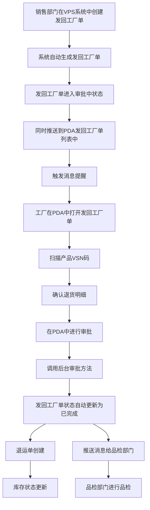

# 《发回工厂单》移动端APP产品需求文档

## 一、文档概述

### 1.1 产品背景

发回工厂单是配合《一物一码》需求上线的PDA单据，旨在将退货入库环节从传统纸质单据变更为扫码入库，实现退货流程的数字化管理。

### 1.2 产品核心目标

- 实现发回工厂单的电子化管理
- 支持产品VSN码的扫描和手动输入
- 提高退货流程的透明度和可追溯性
- 实现退货商品信息的详细管理

### 1.3 适用范围

适用于工厂内部的退货流程管理，包括仓库、物流等相关部门。

### 1.4 术语与缩写说明

| 术语/缩写 | 说明       |
| ----- | -------- |
| VSN   | 产品唯一识别码  |
| HPY   | 发货单号前缀   |
| XSD   | 销售订单编号前缀 |

### 1.5 业务流程图

### 1.6 消息提醒

#### 1.6.1 提醒场景

- 当客服部门在VPS系统中创建退货单并生成发回工厂单后，系统会自动推送消息提醒给仓储部门
- 当工厂在PDA中接收处理了发回工厂单后，系统会自动推送消息提醒给品检部门进行品检

#### 1.6.2 提醒内容

- 标题：新发回工厂单待处理
- 内容：您有一张新的发回工厂单需要处理，单号：\[发货单号]，请及时查看并处理
- 跳转：点击消息直接跳转到该发回工厂单详情页面
- 标题：发回工厂单待品检
- 内容：您有一张发回工厂单需要品检，单号：\[发货单号]，请及时查看并处理
- 跳转：点击消息直接跳转到该发回工厂单品检页面

#### 1.6.3 提醒方式

- PDA端消息通知
- 声音提醒
- 消息中心列表展示

## 二、全局通用规范

### 2.1 全局页面结构规范

- 所有页面采用移动端APP布局，适配不同屏幕尺寸
- 页面顶部为导航栏，包含返回按钮、页面标题和右侧操作按钮
- 页面主体内容区域可滚动
- 页面底部为操作按钮区域（如适用）

### 2.2 导航栏通用规则

- 左侧：返回按钮，点击返回上一页
- 中间：页面标题，居中显示
- 右侧：操作按钮，如保存、设置等

### 2.3 通用弹窗与Toast规范

- 操作成功/失败提示使用Toast
- 确认操作使用模态弹窗
- 输入错误提示使用内联提示

### 2.4 通用状态规范

- 加载状态：显示加载动画
- 空状态：显示空状态提示
- 成功状态：显示成功Toast
- 失败状态：显示失败Toast或错误提示

## 三、核心功能模块需求详情

### 3.1 发回工厂单管理

#### 3.1.1 模块概述

管理发回工厂单的创建、编辑、查看、提交和查询等功能，支持批量操作和数据统计分析。

#### 3.1.3 子页面需求详情

##### 3.1.3.1 发回工厂单页面

###### 3.1.3.1.1 页面概述

显示发回工厂单的详细信息，包括基本信息、收货人信息、产品信息等，支持产品的添加、编辑和删除。

###### 3.1.3.1.2 页面布局与控件

1. **导航栏**：
   - 左侧：返回按钮，点击返回上一页
   - 中间：页面标题"发回工厂单"
   - 右侧：
     - 保存为草稿按钮，点击保存当前状态为草稿
     - 设置按钮，点击跳转到设置页面
2. **订单信息区域**：
   - 发货单号：文本显示，系统自动生成，只读
   - 单据日期：文本显示，系统自动生成，只读
   - 需求日期：文本显示，系统自动生成，只读
   - 制单人：文本显示，系统自动填充当前用户，只读
   - 部门：文本显示，系统自动填充当前用户所在部门，只读
   - 发货说明：文本显示，系统自动生成，只读
   - 发货人：文本显示，系统自动填充当前用户，只读
   - 发货类型：文本显示，系统自动生成，只读
   - 发回类型：文本显示，系统自动生成，只读
   - 收货人：文本显示，系统自动生成，只读
   - 收货电话：文本显示，系统自动生成，只读
   - 收货地址：文本显示，系统自动生成，只读
   - 退货单号：文本显示，系统自动生成，只读
   - 备注：文本输入框，非必填
3. **扫描产品VSN码区域**：
   - 标题："扫描产品VSN码"
   - 按实体键扫描按钮：点击启动扫码功能
   - 手动输入产品编码/VSN：输入框
   - 添加按钮：点击添加产品到退货明细
4. **退货明细区域**：
   - 标题："退货明细"
   - 产品项：
     - 唯一码商品：
       - 序号
       - 产品图片
       - 物料编码：文本显示
       - 单位：文本显示
       - 类型：文本显示，"唯一码商品"
       - VSN列表：包含VSN、库位、发货确认数量（可编辑输入框）、收货确认数量（可编辑输入框）、操作（删除按钮）
     - 商品码商品：
       - 序号
       - 产品图片
       - 物料编码：文本显示
       - 单位：文本显示
       - 类型：文本显示，"商品码商品"
       - VSN列表：包含VSN（无）、库位、发货确认数量（可编辑输入框）、收货确认数量（可编辑输入框）、操作（删除按钮、打印标签按钮）
   - 添加更多产品按钮：点击启动扫码功能
   - 已扫描产品数量：文本提示
5. **汇总信息区域**：
   - 产品数量：文本显示
   - 审批状态：文本显示
6. **需求/实际占比区域**：
   - 应退/实退：显示应退数量和实退数量，格式为"应退/实退：\[应退数量]/\[实退数量]"
7. **打印按钮区域**：
   - 实退数量显示：文本显示
   - 打印按钮：点击跳转到打印确认页面
   - 确认审批按钮：点击提交审批结果

###### 3.1.3.1.3 核心交互流程

- 点击返回按钮：返回上一页
- 点击保存为草稿按钮：保存当前状态为草稿
- 点击设置按钮：跳转到设置页面
- 点击按实体键扫描按钮：启动扫码功能
- 点击搜索输入框：激活输入
- 点击添加按钮：添加产品到退货明细
- 点击删除按钮：删除产品
- 点击打印标签按钮：弹出打印标签弹窗
- 点击打印按钮：跳转到打印确认页面
- 点击同意按钮：选择同意审批
- 点击拒绝按钮：选择拒绝审批
- 点击确认审批按钮：提交审批结果

###### 3.1.3.1.4 异常场景与处理

- 扫码失败：显示扫码失败提示，提供重试选项
- 产品VSN码无效：显示产品VSN码无效提示
- 提交时产品数量为0：显示请添加至少一个产品提示
- 网络异常：显示网络异常提示，提供离线模式
- 权限不足：显示权限不足提示

##### 3.1.3.2 发回工厂单列表页面

###### 3.1.3.2.1 页面概述

显示发回工厂单的列表信息，支持新建、搜索和查看详情。

###### 3.1.3.2.2 页面布局与控件

1. **导航栏**：
   - 左侧：返回按钮，点击返回上一页
   - 中间：页面标题"发回工厂单列表"
   - 右侧：空
2. **搜索和操作区域**：
   - 新建按钮：点击跳转到发回工厂单页面
   - 搜索框：输入单据编号/VSN进行检索
   - 排序下拉框：选择排序方式，包括创建时间倒序和创建时间正序
   - 筛选下拉框：选择状态筛选，包括待审批、已确认、已驳回、已取消、草稿
3. **统计信息区域**：
   - 今日数量：文本显示
   - 今日单据数量：文本显示
4. **单据列表区域**：
   - 单据项：
     - 发货单号：文本显示
     - 状态：标签显示（待处理、已完成、审批中）
     - 作业类型：文本显示，"退回工厂"
     - 创建时间：文本显示
     - 制单人：文本显示
     - 操作：打印按钮、查看详情按钮
5. **分页区域**：
   - 上一页按钮
   - 页码：文本显示
   - 下一页按钮

###### 3.1.3.2.3 核心交互流程

- 点击返回按钮：返回上一页
- 点击新建按钮：跳转到发回工厂单页面
- 点击搜索框：激活输入
- 点击排序下拉框：选择排序方式
- 点击筛选下拉框：选择状态筛选
- 点击单据项：跳转到发回工厂单详情页面
- 点击打印按钮：触发打印功能
- 点击上一页按钮：显示上一页数据
- 点击下一页按钮：显示下一页数据

###### 3.1.3.2.4 异常场景与处理

- 搜索无结果：显示无结果提示
- 网络异常：显示网络异常提示
- 权限不足：显示权限不足提示

##### 3.1.3.3 发回工厂单详情页面

###### 3.1.3.3.1 页面概述

显示发回工厂单的详细信息，只读模式，不支持编辑。

###### 3.1.3.3.2 页面布局与控件

1. **导航栏**：
   - 左侧：返回按钮，点击返回发回工厂单列表页面
   - 中间：页面标题"发回工厂单详情"
   - 右侧：空
2. **订单信息区域**：所有字段文本显示
3. **退货明细区域**：
   - 标题："退货明细"
   - 产品项：
     - 序号
     - 产品图片
     - 物料编码：文本显示
     - 单位：文本显示
     - 类型：文本显示
     - 发货数量：文本显示
     - 退货数量：文本显示
     - VSN列表：包含VSN、库位、发货数量、退货数量、操作（不可点击）
4. **汇总信息区域**：
   - 产品数量：文本显示
   - 审批状态：文本显示
5. **操作按钮区域**：
   - 打印按钮：点击触发打印功能

###### 3.1.3.3.3 核心交互流程

- 点击返回按钮：返回发回工厂单列表页面
- 点击打印按钮：触发打印功能

###### 3.1.3.3.4 异常场景与处理

- 网络异常：显示网络异常提示

##### 3.1.3.4 打印确认页面

###### 3.1.3.4.1 页面概述

显示发回工厂单的打印信息，支持打印单据和打印标签。

###### 3.1.3.4.2 页面布局与控件

1. **导航栏**：
   - 左侧：返回按钮，点击返回发回工厂单页面
   - 中间：页面标题"发回工厂单"
   - 右侧：
     - 打印单据按钮：点击跳转到打印预览页面
     - 打印标签按钮：点击弹出打印标签弹窗
2. **订单信息区域**：
   - 发货单号：文本显示
   - 单据日期：文本显示
   - 需求日期：文本显示
   - 制单人：文本显示
   - 部门：文本显示
   - 发货说明：文本显示
   - 发货人：文本显示
   - 发货类型：文本显示
   - 发回类型：文本显示
   - 收货人：文本显示
   - 收货电话：文本显示
   - 收货地址：文本显示
   - 退货单号：文本显示
   - 备注：文本显示
3. **退货明细区域**：
   - 标题："退货明细"
   - 表格：包含序号、产品、产品描述、产品类别、单位、需求数量、发货数量、VSN、备注
4. **汇总信息区域**：
   - 产品数量：文本显示
   - 实退总数：文本显示

###### 3.1.3.4.3 核心交互流程

- 点击返回按钮：返回发回工厂单页面
- 点击打印单据按钮：跳转到打印预览页面
- 点击打印标签按钮：弹出打印标签弹窗

###### 3.1.3.4.4 异常场景与处理

- 打印失败：显示打印失败提示

##### 3.1.3.5 打印预览页面

###### 3.1.3.5.1 页面概述

显示发回工厂单的打印预览，支持打印设置和打印操作。

###### 3.1.3.5.2 页面布局与控件

1. **导航栏**：
   - 左侧：返回按钮，点击返回打印确认页面
   - 中间：页面标题"打印预览"
   - 右侧：空
2. **打印设置区域**：
   - 打印机：下拉选择框，默认值为"导出为PDF"
   - 份数：输入框，默认值为"1"
   - 布局：单选框，默认选中"纵向"
   - 页面：单选框，默认选中"全部"
   - 颜色：下拉选择框，默认值为"彩色"
   - 打印按钮：点击触发打印功能
   - 取消按钮：点击返回打印确认页面
3. **预览内容区域**：
   - 预览发回工厂单内容，包含发回工厂单信息、退货明细、汇总信息

###### 3.1.3.5.3 核心交互流程

- 点击返回按钮：返回打印确认页面
- 点击打印机下拉选择框：展开选项列表
- 点击份数输入框：激活输入
- 点击布局单选框：切换布局
- 点击页面单选框：切换页面选项
- 点击颜色下拉选择框：展开选项列表
- 点击打印按钮：触发打印功能
- 点击取消按钮：返回打印确认页面

###### 3.1.3.5.4 异常场景与处理

- 打印失败：显示打印失败提示

##### 3.1.3.6 设置页面

###### 3.1.3.6.1 页面概述

显示字段显示设置，支持开启/关闭字段显示。

###### 3.1.3.6.2 页面布局与控件

1. **导航栏**：
   - 左侧：返回按钮，点击返回发回工厂单页面
   - 中间：页面标题"设置"
   - 右侧：空
2. **设置内容区域**：
   - 标题："字段显示设置"
   - 设置项：
     - 发货单号：开关，默认开启
     - 单据日期：开关，默认开启
     - 需求日期：开关，默认开启
     - 制单人：开关，默认开启
     - 部门：开关，默认开启
     - 发货说明：开关，默认开启
     - 发货类型：开关，默认开启
     - 发回类型：开关，默认开启
     - 收货人：开关，默认开启
     - 收货电话：开关，默认开启
     - 收货地址：开关，默认开启
     - 退货单号：开关，默认开启
     - 单据状态：开关，默认开启
     - 物料编码：开关，默认开启
     - 单位：开关，默认开启
     - 类型：开关，默认开启
     - VSN：开关，默认开启
     - 库位：开关，默认开启
     - 发货数量：开关，默认开启
     - 退货数量：开关，默认开启

###### 3.1.3.6.3 核心交互流程

- 点击返回按钮：返回发回工厂单页面
- 点击开关：切换字段显示状态

## 四、系统关联说明

由于PDA上的单据信息来源是VPS系统，各种操作也是跟系统打通的，因此一些数量或者逻辑的校验，都跟系统同步，系统上怎么校验的，PDA也是怎么校验。

## 五、其他补充说明

- 本需求文档基于提供的原型图生成，如有与实际业务需求不符的地方，以实际业务需求为准。

