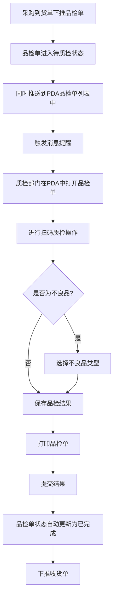
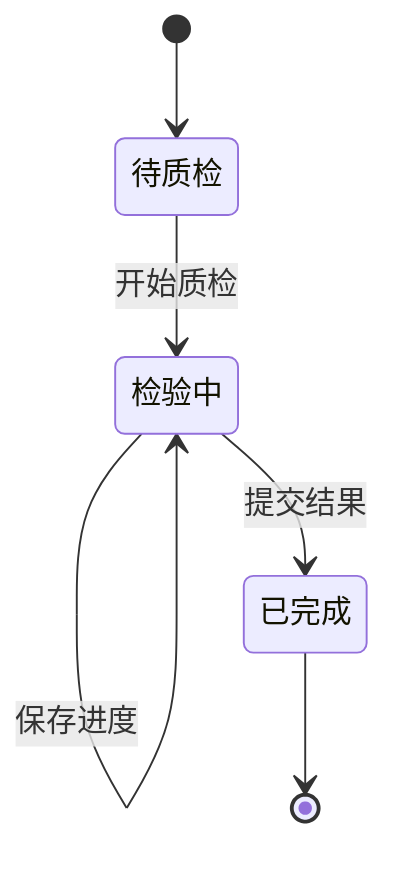

# 《品检单》移动端APP产品需求文档

## 一、文档概述

### 1.1 产品背景

品检单是配合《采购到货单》需求上线的PDA单据，旨在将品检环节从传统纸质单据变更为扫码质检，实现品检流程的数字化管理。

### 1.2 产品核心目标

- 简化品检流程，提高工作效率
- 确保物料质量的准确性和可追溯性
- 实现品检过程的数字化管理
- 提供实时的品检状态和结果信息

### 1.3 适用范围

适用于质检部门对采购到货物料进行质量检验的场景，主要用户为质检人员。

### 1.4 术语与缩写说明

- VSN：物料唯一标识码
- PDA：掌上电脑，用于仓库扫码操作
- PJD：品检单
- RKD：到货单

### 1.5 需求优先级定义说明

- 【P0-核心必做】：核心功能，必须实现，直接影响产品正常使用
- 【P1-重要迭代】：重要功能，影响用户体验但不影响核心流程
- 【P2-远期优化】：优化功能，可在后续版本中实现

### 1.6 业务流程图

### 1.7 单据状态机

#### 1.7.1 状态定义

| 状态 | 状态码 | 描述 |
|------|--------|------|
| 待质检 | PENDING | 品检单已创建，等待质检 |
| 检验中 | INSPECTING | 正在进行质检操作 |
| 已完成 | COMPLETED | 品检单已提交并下推收货单 |

#### 1.7.2 状态流转规则

#### 1.7.3 状态流转触发条件

| 流转 | 触发条件 | 操作权限 |
|------|----------|----------|
| 待质检→检验中 | 用户打开品检单 | 质检人员 |
| 检验中→已完成 | 用户点击"提交结果"按钮 | 质检人员 |

### 1.8 消息提醒

#### 1.8.1 提醒场景

- 当采购到货单下推品检单后，系统会自动推送消息提醒给质检部门

#### 1.8.2 提醒内容

- 标题：新品检单待处理
- 内容：您有一张新品检单需要处理，单号：\[品检单号]，请及时查看并处理
- 跳转：点击消息直接跳转到该品检单详情页面

#### 1.8.3 提醒方式

- PDA端消息通知
- 声音提醒
- 消息中心列表展示

### 1.9 输入控件规范说明

#### 1.9.1 选择框类型说明

| 控件类型 | 说明 | 使用场景 |
|----------|------|----------|
| 下拉选择框 | 点击后从下方弹出选项列表，仅支持单选（只能选择1个选项），下拉列表最多一次性显示5个选项，超出部分需点击"更多"查看 | 选项较少（≤10个）的场景，如检验类型、检验员等 |
| 点击选择框 | 点击后跳转新页面或弹出弹窗选择，支持单选/多选 | 选项较多（>10个）或需要搜索的场景 |

#### 1.9.2 文本内容换行规则

- 单行显示：选择框选中的内容在一行内显示，超出部分用"..."省略
- 下拉选项：下拉列表最多一次性显示5个选项，超出部分需点击"更多"查看，单个选项内容最多显示1行，超出部分用"..."省略
- 输入框：自动换行，最多显示3行，超出部分可滚动查看

#### 1.9.3 输入框类型说明

| 控件类型 | 说明 | 使用场景 |
|----------|------|----------|
| 文本输入框 | 单行文本输入，自动适配内容宽度 | 备注、名称等短文本输入 |
| 文本域 | 多行文本输入，支持换行 | 备注、说明等长文本输入 |
| 数字输入框 | 仅允许输入数字，自动弹出数字键盘 | 数量、金额等数值输入 |
| 日期选择器 | 点击弹出日期选择弹窗，支持选择日期 | 日期选择场景 |

## 二、全局通用规范【P0-核心必做】

### 2.1 页面结构
- **布局**：卡片式设计，顶部导航栏固定，内容区域可滚动，底部操作按钮固定
- **导航栏**：左侧返回按钮、中间页面标题、右侧功能按钮
- **交互**：点击操作按钮/列表项，长按显示更多选项，滑动滚动列表

### 2.2 状态规范
- **加载状态**：显示加载动画
- **空状态**：列表无数据时显示提示
- **成功/失败状态**：操作后显示相应提示

### 2.3 弹窗与Toast
- **确认弹窗**：用于删除、提交等重要操作
- **提示Toast**：轻量级提示，自动消失

### 2.4 权限管理
- **权限来源**：后台权限系统
- **权限控制**：按角色分配功能访问权限，不同角色用户只能访问其被授权的功能。
- **权限验证**：操作前验证用户权限

### 2.5 系统适配

- PDA默认使用安卓系统
- 使用安卓原生控件样式，如导航栏、按钮等

## 三、核心功能模块需求详情

### 3.1 品检单列表【P0-核心必做】

#### 3.1.1 模块业务主流程

1. 用户打开品检单列表页面
2. 查看所有品检单信息，包括来源单据及其关联品检单数量
3. 使用搜索、筛选、排序功能找到目标品检单
4. 点击列表项查看品检单详情（待质检状态跳转新增质检单页面，已完成状态跳转已完成品检单页面）
5. 点击新增按钮创建新品检单

#### 3.1.2 子页面需求详情

##### 3.1.2.1 品检单列表页面【P0-核心必做】

###### 3.1.2.1.1 页面概述

展示所有品检单的列表，包含单号、状态、来源单据等信息，支持搜索、筛选和排序功能。

###### 3.1.2.1.2 页面前置条件

- 用户已登录系统
- 网络连接正常

###### 3.1.2.1.3 页面后置条件

- 点击列表项，已完成的单子跳转到品检单页面，待质检的单子跳转到新增质检单详情页
- 点击新增按钮跳转到新增品检单页面

###### 3.1.2.1.4 【原型描述】页面整体布局与全控件详情

- 顶部导航栏：
  - 左侧：返回按钮
  - 中间：页面标题"品检单列表"
  - 右侧：无
- 搜索区域：
  - 搜索框：文本输入框，占位符"输入单据编号/VSN进行检索"，单行显示，超出部分省略
  - 右侧：排序按钮和筛选按钮
- 统计信息区域：
  - 左侧：今日数量（取自列表合计今日品检数量）
  - 右侧：今日单据数量（取自列表合计，今天单据的数量）
- 列表区域：
  - 列表项：
    - 头部：
      - 左侧：品检单号
      - 右侧：状态标签（待质检/已完成）
    - 详情：
      - 来源单据（显示来源到货单号）
      - 创建时间（系统自动生成，记录单据创建时间）
    - 操作按钮：
      - 打印按钮：点击跳转到品检单详情页
      - 去质检按钮（仅待质检状态显示）

###### 3.1.2.1.5 核心交互流程说明

1. 搜索：在搜索框输入品检单号，系统实时显示匹配结果
2. 筛选：点击筛选按钮，从右侧滑出筛选抽屉，选择状态（待质检/已完成）进行筛选
3. 排序：点击排序按钮，弹出排序选项菜单，选择排序方式（创建时间正序、创建时间倒序）。默认按照创建时间倒序排序，最近的在上面，最远的在下面
4. 查看详情：点击列表项，已完成的单子跳转到品检单页面，待质检的单子跳转到新增质检单详情页
5. 去质检：点击去质检按钮，处理待质检状态的单子

###### 3.1.2.1.6 异常场景与处理逻辑

- 无网络连接：显示网络异常提示，点击重试按钮重新加载
- 无数据：显示空状态提示，提示用户暂无品检单

###### 3.1.2.1.7 功能验收标准

- 搜索功能：输入品检单号后，列表实时显示匹配结果
- 筛选功能：选择状态后，列表显示对应状态的品检单
- 排序功能：选择排序方式后，列表按照指定方式排序
- 跳转功能：点击列表项成功跳转到查看页面，点击新增按钮成功跳转到新增页面

### 3.2 新增品检单【P0-核心必做】

#### 3.2.1 模块业务主流程

1. 质检部门打开新增品检单页面
2. 编辑基本信息（来源单据、检验类型等）
3. 扫描物料条码进行质检
4. 录入质检结果（良品/不良品）
5. 提交品检结果
6. 下推收货单

#### 3.2.2 子页面需求详情

##### 3.2.2.1 新增品检单页面【P0-核心必做】

###### 3.2.2.1.1 页面概述

用于创建新品检单，包含基本信息编辑、物料扫码质检、结果录入等功能。

###### 3.2.2.1.2 页面前置条件

- 用户已登录系统
- 网络连接正常

###### 3.2.2.1.3 页面后置条件

- 保存草稿：品检单保存为草稿状态
- 提交结果：品检单提交成功，跳转到查看页面

###### 3.2.2.1.4 【原型描述】页面整体布局与全控件详情

- 顶部导航栏：
  - 左侧：返回按钮
  - 中间：页面标题"新增品检单"
  - 右侧：保存为草稿按钮、设置按钮
- 信息编辑区域：
  - 品检单号：文本显示，系统自动生成，只读
  - 单据日期：日期选择器，默认值为当前日期，必填
  - 来源单据：下拉选择框，默认值为关联的到货单号，系统带出，必填
  - 检验类型：下拉选择框，包含销售退货送检、生产送检、采购到货送检、其他送检、维修送检、维修复检、在库复检，默认值为采购到货送检，必填
  - 检验员：下拉选择框，默认为当前账号登录人，必填
  - 单据状态：标签，显示"待质检"或"已完成"
- 扫码检验设置：
  - 良品按钮：绿色，选中状态，选中后扫码录入的均为良品
  - 不良品按钮：灰色，未选中状态，点击后跳转到不良品类型选择页面
- 扫描区域：
  - 扫描按钮：显示"扫描产品VSN码"，右侧显示"按实体键扫描"
  - 搜索框：文本输入框，占位符"搜索产品编码/VSN"，单行显示
- 品检明细区域：
  - 品检项：
    - 头部：
      - 左侧：序号
      - 右侧：物料编码
    - 详情：
      - 左侧：物料图片
      - 右侧：
        - 物料名称：显示物料名称
        - 单位：显示物料单位
        - 类型：显示产品类型（唯一码商品/商品码商品）
        - 应到数量和实到数量：显示应到和实到数量
        - 唯一码商品表格：包含VSN、库位、数量、操作列
          - VSN：文本显示，显示物料唯一标识码（仅唯一码商品有）
          - 库位：下拉选择框，显示物料存放位置
          - 数量：数字显示，固定为1
          - 操作：包含打印和删除按钮
        - 商品码商品表格：包含库位、不良品数量、操作列
          - 库位：下拉选择框，显示物料存放位置
          - 不良品数量：数字输入框
          - 操作：包含打印和删除按钮
        - 打印按钮校验：同一供应商同一产品当月第一次入库提示打码，后续不打码
    - 删除按钮
- 统计区域：
  - 品检总数：显示品检总数量
  - 良品数量：显示良品数量
  - 不良数量：显示不良数量
  - 合格率：显示合格百分比
  - 不良率：显示不良百分比
- 底部操作区域（新增页面）：
  - 打印单据按钮：点击后弹窗提示"打印品检单"，然后调用浏览器打印功能打印当前单据页面
  - 提交结果按钮：点击后提交品检结果，跳转到已完成品检单页面
- 底部操作区域（已完成页面）：
  - 下推收货单按钮：点击后弹窗提示已下推收货单，采购入库人员将收到入库待办提醒
  - 打印单据按钮：点击后弹窗提示"打印品检单"，然后调用浏览器打印功能打印当前单据页面
- 物料项操作按钮：
  - 打印图标（🖨️）：点击后弹窗提示"打印标签"

###### 3.2.2.1.5 核心交互流程说明

1. 编辑基本信息：修改来源单据、检验类型等
2. 设置检验结果：点击良品按钮设置默认检验结果为良品；点击不良品按钮跳转到不良品类型选择页面
3. 扫描物料：点击扫描按钮，启动摄像头扫描物料条码
4. 搜索物料：在搜索框输入物料编码或VSN码，显示匹配结果
5. 删除物料：点击删除按钮，确认后删除物料
6. 保存草稿：点击保存按钮，保存当前编辑内容
7. 打印单据：点击打印单据按钮，弹窗提示后调用浏览器打印功能打印当前页面
8. 打印标签：点击物料项的打印图标，弹窗提示打印标签
9. 提交结果：点击提交结果按钮，系统验证信息并提交，跳转到已完成品检单页面
10. 下推收货单（已完成页面）：点击下推收货单按钮，弹窗提示已下推，采购入库人员收到入库待办提醒
11. 不良品处理：点击不良品按钮跳转到不良品类型选择页面，选择A/B/C/D类不良品后自动归入对应不良品库

###### 3.2.2.1.6 异常场景与处理逻辑

- 扫描失败：显示扫描失败提示，提示用户重新扫描
- 搜索无结果：显示无结果提示，提示用户检查输入
- 提交时无物料：显示提示，要求用户至少添加一个物料
- 保存为草稿后不可删除：品检单保存为草稿状态（PDA草稿）后，在PDA上不可删除该单据，只能继续编辑或提交

###### 3.2.2.1.7 功能验收标准

- 基本信息编辑：成功修改来源单据、检验类型等
- 物料添加：成功通过扫描或搜索添加物料
- 检验结果录入：成功录入检验结果
- 保存功能：成功保存草稿，状态变为"待质检（PDA草稿）"
- 删除功能：PDA草稿状态的单据不可删除
- 打印功能：成功跳转到打印预览页面
- 提交功能：成功提交品检单
- 不良品分类：成功选择A/B/C/D类不良品并归入对应不良品库
- 字段自定义：成功通过设置弹窗自定义显示字段

### 3.3 不良品类型选择【P0-核心必做】

#### 3.3.1 业务规则说明

- **分批品检入库**：一个到货单可以关联多个品检单，支持分批品检入库的业务场景
- **结果复核推送**：品检单据完成后提交结果，系统会自动推送给相关人员进行复核，相关人员的PDA上会有消息提醒
- **不良品分类规则**：
  - 所有产品均可选择A/B/C/D类不良，系统自动归入对应不良品库

#### 3.3.2 模块业务主流程

1. 扫描不良品产品VSN码
2. 查看产品信息
3. 选择不良品类型（A/B/C/D类）
4. 查看目标库位信息
5. 确认选择，产品归入对应不良品库

#### 3.3.3 子页面需求详情

##### 3.3.3.1 不良品类型选择页面【P0-核心必做】

###### 3.3.3.1.1 页面概述

用于选择不良品类型，包含扫码区域、产品信息展示、不良品类型选择、目标库位信息和确认按钮。

###### 3.3.3.1.2 页面前置条件

- 用户已登录系统
- 网络连接正常

###### 3.3.3.1.3 页面后置条件

- 确认选择后，产品归入对应不良品库并返回上一页

###### 3.3.3.1.4 【原型描述】页面整体布局与全控件详情

- 顶部导航栏：
  - 左侧：返回按钮
  - 中间：页面标题"选择不良品类型"
  - 右侧：无
- 扫码区域：
  - 扫描按钮：显示"扫描产品VSN码"，右侧显示"扫描"
  - 已扫码信息：显示产品VSN、产品名称、物料编码、产品类型标签
- 不良品类型选择区域：
  - 标题：请选择不良品类型
  - 说明：所有产品均可选择ABCD类不良，系统将自动归入对应不良品库
  - 网格布局展示四种不良品类型：
    - A类：严重不良，影响安全/功能，红色背景
    - B类：较严重不良，影响外观/性能，橙色背景
    - C类：一般不良，轻微瑕疵，蓝色背景
    - D类：轻微不良，不影响使用，绿色背景
- 不良原因输入区域：
  - 标题：不良原因
  - 文本框：文本域，用于输入不良原因描述，最多显示3行，超出部分可滚动
- 目标库位选择：
  - 标题：目标库位
  - 下拉选择框：包含总部不良品仓/A类、B类、C类、D类及其他库位选项，选项超出一行时单行显示省略
  - 选择不良类型后自动匹配对应库位，用户可手动修改
- 底部操作区域：
  - 确认按钮：点击后提交选择

###### 3.3.3.1.5 核心交互流程说明

1. 扫描产品：点击扫描按钮，启动摄像头扫描产品条码
2. 显示界面：显示ABCD类不良品选择网格
3. 选择不良类型：点击选择不良品类型（A/B/C/D类）
4. 选择库位：选择目标库位（选择不良类型后自动匹配对应库位，可修改）
5. 确认选择：只要选择了库位即可点击确认按钮，产品归入对应不良品库

###### 3.3.3.1.6 异常场景与处理逻辑

- 扫描失败：显示扫描失败提示，提示用户重新扫描
- 未选择库位点击确认：按钮禁用，提示用户先选择目标库位

###### 3.3.3.1.7 功能验收标准

- 扫描功能：成功扫描产品条码并显示产品信息
- 类型选择：成功选择A/B/C/D类不良品
- 库位选择：成功选择目标库位，选择不良类型后自动匹配对应库位
- 确认功能：选择库位后即可点击确认按钮，成功提交选择并返回上一页

### 3.4 品检单详情【P0-核心必做】

已完成状态的品检单页面，用于查看详情和打印单据，布局与3.2新增品检单页面一致，仅底部操作区域不同：
- 下推收货单按钮：点击后弹窗提示已下推收货单，采购入库人员将收到入库待办提醒
- 打印单据按钮：点击后弹窗提示"打印品检单"，然后调用浏览器打印功能打印当前单据页面

### 3.5 品检明细字段说明

| 类型 | 字段 | 说明 |
| --- | --- | --- |
| 唯一码商品 | VSN | 产品唯一标识码（V+8位数字） |
| 唯一码商品 | 库位 | 下拉单选选择框，产品所在库位 |
| 唯一码商品 | 数量 | 数字显示，固定为1 |
| 商品码商品 | 库位 | 下拉单选选择框，产品所在库位 |
| 商品码商品 | 数量 | 数字输入框，可编辑 |
| 通用 | 操作 | 打印按钮、删除按钮 |

> **注意**：商品码商品表格不显示VSN列。

### 3.6 不良品分类说明

| 类别 | 名称 | 描述 | 对应库位 |
| --- | --- | --- | --- |
| A类 | 严重不良 | 影响安全/功能 | 总部不良品仓/A类 |
| B类 | 较严重不良 | 影响外观/性能 | 总部不良品仓/B类 |
| C类 | 一般不良 | 轻微瑕疵 | 总部不良品仓/C类 |
| D类 | 轻微不良 | 不影响使用 | 总部不良品仓/D类 |

### 3.7 字段自定义说明

- **表头字段**：品检单号、来源单据号、采购订单号、品检日期、备注
- **明细字段**：VSN、库位、良品数量、不良品数量
- **字段控制**：通过开关控制显示/隐藏，长按拖拽调整顺序

### 3.8 品检VSN列表【P0-核心必做】

**概述**：展示唯一码商品的所有VSN信息，支持分页浏览、搜索和操作功能，解决大量VSN展示问题。

**前置条件**：用户已登录，从品检单页面点击"查看全部VSN"按钮进入

**页面布局**：
- 顶部导航栏：返回按钮、页面标题
- 物料信息栏：物料名称、物料编码、应检数量
- 搜索区域：搜索框，文本输入框，按VSN码实时搜索，单行显示
- 统计信息：总记录数、当前显示范围
- VSN表格：序号、VSN、库位、良品数量、操作（打印、删除）
  - 库位：下拉单选选择框，显示物料存放位置
  - 良品数量：数字输入框
- 分页区域：上一页、页码信息、下一页
- 底部操作栏：返回按钮、确认按钮

**业务流程**：
1. 进入页面自动加载第一页数据
2. 搜索VSN码实时过滤列表
3. 点击打印按钮弹出打印提示
4. 点击删除按钮删除记录
5. 分页浏览所有VSN
6. 点击确认返回品检单页面

**验收标准**：
- 搜索功能：成功按VSN码过滤列表
- 分页功能：成功切换页面浏览所有记录
- 打印功能：成功弹出打印提示
- 删除功能：成功删除指定VSN记录
- 返回/确认功能：成功返回上一页

## 四、非功能需求规范

### 4.1 性能需求

- 页面加载时间：冷启动≤2s，热启动≤1s
- 操作响应时间：点击操作≤500ms，扫描操作≤2s
- 网络超时：弱网环境下请求超时时间≤10s，超时后显示网络异常状态

### 4.2 兼容性需求

- 支持Android 6.0及以上版本
- 适配不同屏幕尺寸，优先考虑移动设备使用场景

### 4.3 安全需求

- 数据传输加密：所有网络请求使用HTTPS
- 用户认证：使用token进行身份验证
- 权限控制：不同角色有不同的操作权限

### 4.4 其他非功能需求

- 可维护性：代码结构清晰，易于维护
- 可扩展性：支持后续功能扩展
- 可测试性：代码可单元测试，功能可集成测试

## 五、附录

### 5.1 其他补充说明

- 本需求文档基于现有HTML原型和业务流程编写
- 后续可根据实际使用情况进行功能优化和扩展
- 建议在正式上线前进行用户测试，收集反馈后再进行调整