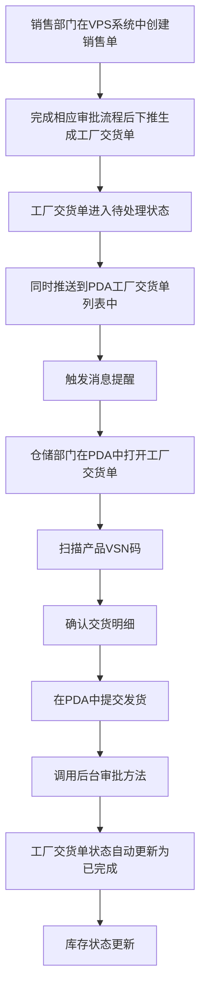
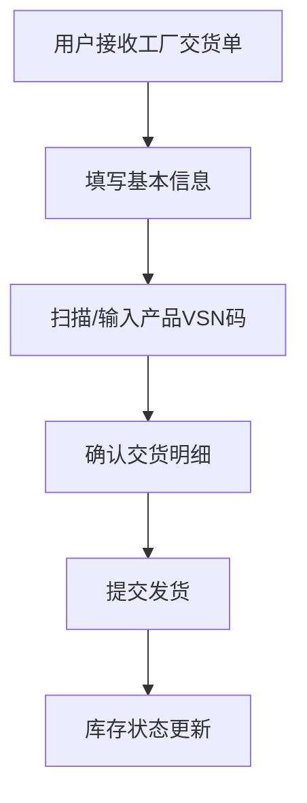

# 《工厂交货单》移动端APP产品需求文档

## 一、文档概述

### 1.1 产品背景

工厂交货单是配合《一物一码》需求上线的PDA单据，旨在将交货出库环节从传统纸质单据变更为扫码出库，实现交货流程的数字化管理。

### 1.2 产品核心目标

- 实现工厂交货单的电子化管理
- 支持产品VSN码的扫描和手动输入
- 提高交货流程的透明度和可追溯性

### 1.3 适用范围

适用于工厂内部的交货流程管理，包括仓库、物流等相关部门。

### 1.4 术语与缩写说明

| 术语/缩写 | 说明        |
| ----- | --------- |
| VSN   | 产品唯一识别码   |
| CKD   | 工厂交货单编号前缀 |
| XSD   | 销售订单编号前缀  |

### 1.5 业务流程图

### 1.6 消息提醒

#### 1.6.1 提醒场景

- 当销售部门在VPS系统中创建销售单并生成工厂交货单后，系统会自动推送消息提醒给仓储部门

#### 1.6.2 提醒内容

- 标题：新工厂交货单待处理
- 内容：您有一张新的工厂交货单需要处理，单号：\[交货单号]，请及时查看并处理
- 跳转：点击消息直接跳转到该工厂交货单详情页面

#### 1.6.3 提醒方式

- PDA端消息通知
- 声音提醒
- 消息中心列表展示

## 二、全局通用规范

### 2.1 全局页面结构规范

- 所有页面采用移动端APP布局，适配不同屏幕尺寸
- 页面顶部为导航栏，包含返回按钮、页面标题和右侧操作按钮
- 页面主体内容区域可滚动
- 页面底部为操作按钮区域（如适用）

### 2.2 导航栏通用规则

- 左侧：返回按钮，点击返回上一页
- 中间：页面标题，居中显示
- 右侧：操作按钮，如保存、设置等

### 2.3 通用弹窗与Toast规范

- 操作成功/失败提示使用Toast
- 确认操作使用模态弹窗
- 输入错误提示使用内联提示

### 2.4 通用状态规范

- 加载状态：显示加载动画
- 空状态：显示空状态提示
- 成功状态：显示成功Toast
- 失败状态：显示失败Toast或错误提示

## 三、核心功能模块需求详情

### 3.1 工厂交货单管理

#### 3.1.1 模块概述

管理工厂交货单的创建、编辑、查看、提交和查询等功能，支持批量操作和数据统计分析。

#### 3.1.2 模块业务主流程

#### 3.1.3 子页面需求详情

##### 3.1.3.1 工厂交货单页面

###### 3.1.3.1.1 页面概述

显示交货单的详细信息，包括基本信息、收货人信息、产品信息等，支持产品的添加、编辑和删除。

###### 3.1.3.1.2 页面布局与控件

1. **导航栏**：
   - 左侧：返回按钮，点击返回上一页
   - 中间：页面标题"工厂交货单"
   - 右侧：
     - 保存为草稿按钮，点击保存当前状态为草稿
     - 设置按钮，点击跳转到设置页面
2. **交货单信息区域**：
   - 交货单号：文本显示，系统自动带出，只读
   - 安排日期：日期选择器，必填，默认值为创建单据的日期
   - 截止日期：文本显示，系统自动带出，只读
   - 物流单号：输入框，可编辑，非必填
   - 是否为手机配件：复选框，非必填
   - 收货人姓名：文本显示，系统自动带出，只读
   - 收货人电话：文本显示，系统自动带出，只读
   - 收货人地址：文本显示，系统自动带出，只读
   - 原销售端单号：文本显示，系统自动带出，只读
   - 源单据：文本显示，系统自动带出，只读
   - 发货说明：文本显示，系统自动带出，只读
   - 部门：文本显示，系统自动带出，只读
   - 源位置：下拉单选框，必填，默认值为"成都总仓/发货仓"
   - 备注：输入框，可编辑，非必填
3. **扫描产品条码区域**：
   - 标题："扫描产品条码"
   - 按实体键扫描按钮：点击启动扫码功能
   - 手动输入产品编码/VSN：输入框，占位符"搜索产品编码或名称"
   - 添加按钮：点击添加产品到交货明细
4. **交货明细区域**：
   - 标题："交货明细"
   - 产品项：
     - 唯一码商品：
       - 序号
       - 产品图片
       - 物料编码：文本显示
       - 物料名称：文本显示
       - 单位：文本显示
       - 类型：文本显示，"唯一码商品"
       - 应发数量：文本显示
       - 可用数量：文本显示
       - 列表：包含VSN、库位（可编辑下拉框）、实发数量（可编辑输入框）、操作（删除按钮）、查看全部VSN →（点击查看改物料已扫描的全部VSN列表）
     - 商品码商品：
       - 序号
       - 产品图片
       - 物料编码：文本显示
       - 物料名称：文本显示
       - 单位：文本显示
       - 类型：文本显示，"商品码商品"
       - 应发数量：文本显示
       - 可用数量：文本显示
       - 列表：包含库位（可编辑下拉框）、实发数量（可编辑输入框）、操作（删除按钮）
   - 已扫描产品数量：文本提示
5. **汇总信息区域**：
   - 产品数量：文本显示
6. **需求/实际占比区域**：
   - 应发/实发：显示应发数量和实发数量总计，格式为"应发/实发：\[应发数量]/\[实发数量]"
7. **底部按钮区域**：
   - 打印按钮：点击跳转到打印页面
   - 提交发货按钮：点击提交交货单

###### 3.1.3.1.3 核心交互流程

- 点击返回按钮：返回上一页
- 点击保存为草稿按钮：保存当前状态为草稿
- 点击设置按钮：跳转到设置页面
- 点击日期选择器：弹出日期选择界面
- 点击是否为手机配件复选框：切换选中状态
- 点击按实体键扫描按钮：启动扫码功能
- 点击搜索产品编码或名称：激活输入
- 点击添加按钮：添加产品到交货明细
- 点击删除按钮：删除产品
- 点击打印按钮：跳转到打印确认页面
- 点击提交发货按钮：提交交货单

###### 3.1.3.1.4 异常场景与处理

- 扫码失败：显示扫码失败提示，提供重试选项
- 产品VSN码无效：显示产品VSN码无效提示
- 提交时产品数量为0：显示请添加至少一个产品提示
- 网络异常：显示网络异常提示，提供离线模式
- 权限不足：显示权限不足提示

##### 3.1.3.2 工厂交货单列表页面

###### 3.1.3.2.1 页面概述

显示工厂交货单的列表信息，支持搜索、筛选和查看详情、不支持新建（工厂交货单由销售单下推而来）。

###### 3.1.3.2.2 页面布局与控件

1. **导航栏**：
   - 左侧：返回按钮，点击返回上一页
   - 中间：页面标题"工厂交货单列表"
   - 右侧：空
2. **搜索和操作区域**：
   - 搜索框：输入单据编号/VSN进行检索
   - 排序下拉框：选择排序方式，包括创建时间倒序和创建时间正序
   - 筛选下拉框：选择状态筛选，包括待处理、已完成、草稿
3. **统计信息区域**：
   - 今日数量：文本显示（取自列表合计今日交货数量）
   - 今日单据数量：文本显示（取自列表合计今日单据数量）
4. **单据列表区域**：
   - 单据项：
     - 交货单号：文本显示
     - 状态：标签显示（待处理、已完成、草稿）
     - 作业类型：文本显示，"工厂交货"
     - 创建时间：文本显示
     - 制单人：文本显示
     - 操作：打印按钮
5. **分页区域**：
   - 上一页按钮
   - 页码：文本显示
   - 下一页按钮

###### 3.1.3.2.3 核心交互流程

- 点击返回按钮：返回上一页
- 点击搜索框：激活输入
- 点击排序下拉框：选择排序方式
- 点击筛选下拉框：选择状态筛选
- 点击单据项：跳转到工厂交货单详情页面
- 点击打印按钮：触发打印功能
- 点击上一页按钮：显示上一页数据
- 点击下一页按钮：显示下一页数据

###### 3.1.3.2.4 异常场景与处理

- 搜索无结果：显示无结果提示
- 网络异常：显示网络异常提示
- 权限不足：显示权限不足提示

##### 3.1.3.3 工厂交货单详情页面

###### 3.1.3.3.1 页面概述

显示工厂交货单的详细信息，只读模式，不支持编辑。

###### 3.1.3.3.2 页面布局与控件

1. **导航栏**：
   - 左侧：返回按钮，点击返回工厂交货单列表页面
   - 中间：页面标题"工厂交货单详情"
   - 右侧：空
2. **交货单信息区域**：
   - 交货单号：文本显示
   - 安排日期：文本显示
   - 截止日期：文本显示
   - 物流单号：文本显示
   - 是否为手机配件：文本显示
   - 收货人姓名：文本显示
   - 收货人电话：文本显示
   - 收货人地址：文本显示
   - 原销售端单号：文本显示
   - 源单据：文本显示
   - 发货说明：文本显示
   - 部门：文本显示
   - 源位置：文本显示
   - 备注：文本显示
3. **交货明细区域**：
   - 标题："交货明细"
   - 产品项：
     - 序号
     - 产品图片
     - 物料编码：文本显示
     - 物料名称：文本显示
     - 单位：文本显示
     - 类型：文本显示
     - 应发数量：文本显示
     - 可用数量：文本显示
     - 列表：包含VSN、库位、实发数量、操作（不可点击）、查看全部VSN →（可点击）
4. **汇总信息区域**：
   - 产品数量：文本显示
5. **打印按钮区域**：
   - 打印按钮：点击触发打印功能

###### 3.1.3.3.3 核心交互流程

- 点击返回按钮：返回工厂交货单列表页面
- 点击打印按钮：触发打印功能

###### 3.1.3.3.4 异常场景与处理

- 网络异常：显示网络异常提示

##### 3.1.3.5 打印预览页面

###### 3.1.3.5.1 页面概述

显示交货单的打印预览，支持打印设置和打印操作。

###### 3.1.3.5.2 页面布局与控件

1. **导航栏**：
   - 左侧：返回按钮，点击返回打印确认页面
   - 中间：页面标题"打印预览"
   - 右侧：空
2. **打印设置区域**：
   - 打印机：下拉选择框，默认值为"导出为PDF"
   - 份数：输入框，默认值为"1"
   - 布局：单选框，默认选中"纵向"
   - 页面：单选框，默认选中"全部"
   - 颜色：下拉选择框，默认值为"彩色"
   - 打印按钮：点击触发打印功能
   - 取消按钮：点击返回打印确认页面
3. **预览内容区域**：
   - 预览交货单内容，包含交货单信息、交货明细、汇总信息

###### 3.1.3.5.3 核心交互流程

- 点击返回按钮：返回打印确认页面
- 点击打印机下拉选择框：展开选项列表
- 点击份数输入框：激活输入
- 点击布局单选框：切换布局
- 点击页面单选框：切换页面选项
- 点击颜色下拉选择框：展开选项列表
- 点击打印按钮：触发打印功能
- 点击取消按钮：返回打印确认页面

###### 3.1.3.5.4 异常场景与处理

- 打印失败：显示打印失败提示

##### 3.1.3.6 设置页面

###### 3.1.3.6.1 页面概述

显示字段显示设置，支持开启/关闭字段显示。

###### 3.1.3.6.2 页面布局与控件

1. **导航栏**：
   - 左侧：返回按钮，点击返回工厂交货单页面
   - 中间：页面标题"设置"
   - 右侧：空
2. **设置内容区域**：
   - 标题："字段显示设置"
   - 设置项：
     - 交货单号：开关，默认开启
     - 安排日期：开关，默认开启
     - 截止日期：开关，默认开启
     - 送货地址：开关，默认开启
     - 制单人：开关，默认开启
     - 部门：开关，默认开启
     - 原销售单号：开关，默认开启
     - 物料编码：开关，默认开启
     - 单位：开关，默认开启
     - VSN：开关，默认开启
     - 库位：开关，默认开启
     - 实发数量：开关，默认开启

###### 3.1.3.6.3 核心交互流程

- 点击返回按钮：返回工厂交货单页面
- 点击开关：切换字段显示状态

## 四、字段填写逻辑说明

### 4.1 交货单信息区域字段

| 字段名     | 控件类型  | 必填 | 默认值      | 填写逻辑                                  |
| ------- | ----- | -- | -------- | ------------------------------------- |
| 交货单号    | 文本显示  | 否  | 系统自动生成   | 只读，系统根据规则自动生成                         |
| 安排日期    | 日期选择器 | 是  | 创建单据的日期  | 点击弹出日期选择器，可选择日期                       |
| 截止日期    | 文本显示  | 否  | 系统自动计算   | 只读，系统根据业务规则自动计算                       |
| 是否为手机配件 | 复选框   | 否  | 未勾选      | 点击切换选中状态                              |
| 收货人姓名   | 文本显示  | 否  | 系统自动带出   | 只读，从源单据获取                             |
| 收货人电话   | 文本显示  | 否  | 系统自动带出   | 只读，从源单据获取                             |
| 收货人地址   | 文本显示  | 否  | 系统自动带出   | 只读，从源单据获取                             |
| 原销售端单号  | 文本显示  | 否  | 系统自动带出   | 只读，从源单据获取                             |
| 源单据     | 文本显示  | 否  | 系统自动带出   | 只读，从源单据获取                             |
| 发货说明    | 文本显示  | 否  | 系统自动带出   | 只读，从源单据获取                             |
| 部门      | 文本显示  | 否  | 系统自动带出   | 只读，从源单据获取，例如：RD创新部 / 技术部 / IT组-ODOO系统 |
| 源位置     | 下拉选择框 | 是  | 成都总仓/发货仓 | 点击展开选项列表，可选择仓库位置                      |

### 4.2 扫描产品条码区域字段

| 字段名       | 控件类型 | 必填 | 默认值 | 填写逻辑           |
| --------- | ---- | -- | --- | -------------- |
| 搜索产品编码或名称 | 输入框  | 否  | 无   | 可输入产品编码或名称进行搜索 |

### 4.3 交货明细区域字段

| 字段名         | 控件类型  | 必填 | 默认值      | 填写逻辑              |
| ----------- | ----- | -- | -------- | ----------------- |
| 库位（唯一码商品）   | 下拉选择框 | 是  | 源位置选择的仓库 | 点击展开选项列表，可选择库位    |
| 实发数量（唯一码商品） | 输入框   | 是  | 1        | 可编辑输入实发数量，默认为1    |
| 库位（商品码商品）   | 下拉选择框 | 是  | 源位置选择的仓库 | 点击展开选项列表，可选择库位    |
| 实发数量（商品码商品） | 输入框   | 是  | 应发数量     | 可编辑输入实发数量，默认为应发数量 |

### 4.4 打印设置区域字段

| 字段名 | 控件类型  | 必填 | 默认值    | 填写逻辑             |
| --- | ----- | -- | ------ | ---------------- |
| 打印机 | 下拉选择框 | 否  | 导出为PDF | 点击展开选项列表，可选择打印机  |
| 份数  | 输入框   | 否  | 1      | 可编辑输入打印份数        |
| 布局  | 单选框   | 否  | 纵向     | 点击切换布局选项         |
| 页面  | 单选框   | 否  | 全部     | 点击切换页面选项         |
| 颜色  | 下拉选择框 | 否  | 彩色     | 点击展开选项列表，可选择打印颜色 |

### 4.5 设置页面字段

| 字段名   | 控件类型 | 必填 | 默认值 | 填写逻辑       |
| ----- | ---- | -- | --- | ---------- |
| 交货单号  | 开关   | 否  | 开启  | 点击切换字段显示状态 |
| 安排日期  | 开关   | 否  | 开启  | 点击切换字段显示状态 |
| 截止日期  | 开关   | 否  | 开启  | 点击切换字段显示状态 |
| 送货地址  | 开关   | 否  | 开启  | 点击切换字段显示状态 |
| 制单人   | 开关   | 否  | 开启  | 点击切换字段显示状态 |
| 部门    | 开关   | 否  | 开启  | 点击切换字段显示状态 |
| 原销售单号 | 开关   | 否  | 开启  | 点击切换字段显示状态 |
| 物料编码  | 开关   | 否  | 开启  | 点击切换字段显示状态 |
| 单位    | 开关   | 否  | 开启  | 点击切换字段显示状态 |
| VSN   | 开关   | 否  | 开启  | 点击切换字段显示状态 |
| 库位    | 开关   | 否  | 开启  | 点击切换字段显示状态 |
| 实发数量  | 开关   | 否  | 开启  | 点击切换字段显示状态 |

## 五、系统关联说明

由于PDA上的单据信息来源是VPS系统，各种操作也是跟系统打通的，因此一些数量或者逻辑的校验，都跟系统同步，系统上怎么校验的，PDA也是怎么校验。

## 六、其他补充说明

- 本需求文档基于提供的原型图生成，如有与实际业务需求不符的地方，以实际业务需求为准。

