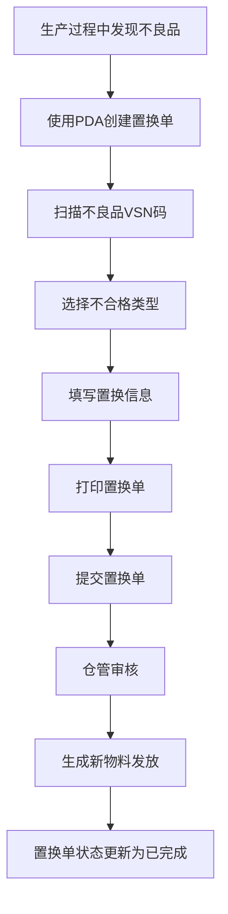
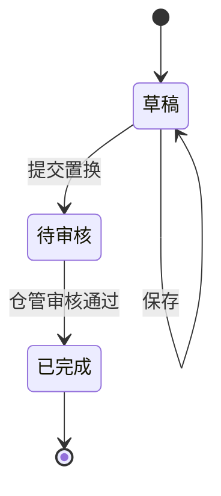

# 《置换单》移动端APP产品需求文档

## 一、文档概述

### 1.1 产品背景

置换单是配合《一物一码》需求上线的PDA单据，旨在处理生产过程中不良品的置换流程，实现置换流程的数字化管理。

### 1.2 产品核心目标

- 简化不良品置换流程，提高工作效率
- 确保物料管理的准确性和可追溯性
- 实现置换过程的数字化管理
- 提供实时的置换状态和统计信息

### 1.3 适用范围

适用于生产部门处理不良品置换的场景，主要用户为生产操作人员和仓库管理人员。

### 1.4 术语与缩写说明

- VSN：物料唯一标识码
- PDA：掌上电脑，用于仓库扫码操作

### 1.5 需求优先级定义说明

- 【P0-核心必做】：核心功能，必须实现，直接影响产品正常使用
- 【P1-重要迭代】：重要功能，影响用户体验但不影响核心流程
- 【P2-远期优化】：优化功能，可在后续版本中实现

### 1.6 业务流程图

### 1.7 单据状态机

#### 1.7.1 状态定义

| 状态 | 状态码 | 描述 |
|------|--------|------|
| 草稿 | DRAFT | 置换单已创建但未提交 |
| 待审核 | PENDING | 置换单已提交，等待仓管审核 |
| 已完成 | COMPLETED | 置换单已审核通过并完成 |

#### 1.7.2 状态流转规则

#### 1.7.3 状态流转触发条件

| 流转 | 触发条件 | 操作权限 |
|------|----------|----------|
| 草稿→待审核 | 用户点击"提交置换"按钮 | 生产人员 |
| 待审核→已完成 | 仓管人员审核通过 | 仓管人员 |

### 1.8 消息提醒

#### 1.8.1 提醒场景

- 当置换单提交后，系统会自动推送消息提醒给仓管人员
- 当置换单审核通过后，系统会自动推送消息提醒给申请人

#### 1.8.2 提醒内容

- 标题：新置换单待审核
- 内容：您有一张新的置换单需要审核，单号：\[置换单号]，请及时查看并处理
- 跳转：点击消息直接跳转到该置换单详情页面

#### 1.8.3 提醒方式

- PDA端消息通知
- 声音提醒
- 消息中心列表展示

### 1.9 输入控件规范说明

#### 1.9.1 选择框类型说明

| 控件类型 | 说明 | 使用场景 |
|----------|------|----------|
| 下拉选择框 | 点击后从下方弹出选项列表，仅支持单选（只能选择1个选项），下拉列表最多一次性显示5个选项，超出部分需点击"更多"查看 | 选项较少（≤10个）的场景，如申请人、仓管人员等 |
| 点击选择框 | 点击后跳转新页面或弹出弹窗选择，支持单选/多选 | 选项较多（>10个）或需要搜索的场景 |

#### 1.9.2 文本内容换行规则

- 单行显示：选择框选中的内容在一行内显示，超出部分用"..."省略
- 下拉选项：下拉列表最多一次性显示5个选项，超出部分需点击"更多"查看，单个选项内容最多显示1行，超出部分用"..."省略
- 输入框：自动换行，最多显示3行，超出部分可滚动查看

#### 1.9.3 输入框类型说明

| 控件类型 | 说明 | 使用场景 |
|----------|------|----------|
| 文本输入框 | 单行文本输入，自动适配内容宽度 | 备注、名称等短文本输入 |
| 文本域 | 多行文本输入，支持换行 | 备注、说明等长文本输入 |
| 数字输入框 | 仅允许输入数字，自动弹出数字键盘 | 数量、金额等数值输入 |
| 日期选择器 | 点击弹出日期选择弹窗，支持选择日期 | 日期选择场景 |

## 二、全局通用规范【P0-核心必做】

### 2.1 页面结构
- **布局**：卡片式设计，顶部导航栏固定，内容区域可滚动，底部操作按钮固定
- **导航栏**：左侧返回按钮、中间页面标题、右侧功能按钮
- **交互**：点击操作按钮/列表项，长按显示更多选项，滑动滚动列表

### 2.2 状态规范
- **加载状态**：显示加载动画
- **空状态**：列表无数据时显示提示
- **成功/失败状态**：操作后显示相应提示

### 2.3 弹窗与Toast
- **确认弹窗**：用于删除、提交等重要操作
- **提示Toast**：轻量级提示，自动消失

### 2.4 权限管理
- **权限来源**：后台权限系统
- **权限控制**：按角色分配功能访问权限
- **权限验证**：操作前验证用户权限

### 2.5 系统适配

- PDA默认使用安卓系统
- 使用安卓原生控件样式，如导航栏、按钮等

## 三、核心功能模块需求详情

### 3.1 置换单列表【P0-核心必做】

#### 3.1.1 模块业务主流程

1. 用户打开置换单列表页面
2. 查看所有置换单信息
3. 使用搜索、筛选、排序功能找到目标置换单
4. 点击列表项查看置换单详情
5. 点击新增按钮创建新的置换单

#### 3.1.2 子页面需求详情

##### 3.1.2.1 置换单列表页面【P0-核心必做】

###### 3.1.2.1.1 页面概述

展示所有置换单的列表，包含单号、状态、申请人等信息，支持搜索、筛选和排序功能。

###### 3.1.2.1.2 页面前置条件

- 用户已登录系统
- 网络连接正常

###### 3.1.2.1.3 页面后置条件

- 点击列表项跳转到查看置换单页面
- 点击新增按钮跳转到新增置换单页面

###### 3.1.2.1.4 【原型描述】页面整体布局与全控件详情

- 顶部导航栏：
  - 左侧：返回按钮
  - 中间：页面标题"置换单列表"
  - 右侧：无
- 搜索区域：
  - 搜索框：文本输入框，占位符"输入单据编号/VSN进行检索"，单行显示，超出部分省略
  - 右侧：排序按钮和筛选按钮
- 统计信息区域：
  - 左侧：今日置换（取自列表合计今日置换数量）
  - 右侧：本月单据（取自列表合计本月单据数量）
- 列表区域：
  - 列表项：
    - 头部：
      - 左侧：置换单号
      - 右侧：状态标签（草稿/检验中/仓管审核/已完成）
    - 详情：
      - 申请人（显示申请人名称）
      - 创建时间（系统自动生成，记录单据创建时间）
    - 操作按钮：
      - 打印按钮：点击跳转到置换单详情页
      - 去处理按钮（仅草稿/检验中状态显示）

###### 3.1.2.1.5 核心交互流程说明

1. 搜索：在搜索框输入置换单号，系统实时显示匹配结果
2. 筛选：点击筛选按钮，从右侧滑出筛选抽屉，选择状态（草稿/检验中/仓管审核/已完成）进行筛选
3. 排序：点击排序按钮，弹出排序选项菜单，选择排序方式（创建时间正序、创建时间倒序）。默认按照创建时间倒序排序
4. 查看详情：点击列表项，根据状态跳转：
   - 已完成状态：跳转到查看置换单页面
   - 待处理状态：跳转到新增置换单页面（处理页面）
5. 去处理：点击去处理按钮，跳转到新增置换单页面处理待处理状态的单子

###### 3.1.2.1.6 异常场景与处理逻辑

- 无网络连接：显示网络异常提示，点击重试按钮重新加载
- 无数据：显示空状态提示，提示用户暂无置换单

###### 3.1.2.1.7 功能验收标准

- 搜索功能：输入置换单号后，列表实时显示匹配结果
- 筛选功能：选择状态后，列表显示对应状态的置换单
- 排序功能：选择排序方式后，列表按照指定方式排序
- 跳转功能：点击列表项成功跳转到查看页面，点击新增按钮成功跳转到新增页面

### 3.2 置换单详情【P0-核心必做】

#### 3.2.1 模块业务主流程

1. 生产部门打开置换单页面
2. 编辑基本信息（申请人、仓管人员、备注）
3. 扫描不良品VSN码添加物料
4. 选择不合格类型
5. 点击打印单据按钮进行打印
6. 提交置换单

#### 3.2.2 子页面需求详情

##### 3.2.2.1 置换单详情页面【P0-核心必做】

###### 3.2.2.1.1 页面概述

用于创建和查看置换单，包含基本信息编辑、不良品扫码添加、不合格类型选择、打印单据等功能。

###### 3.2.2.1.2 页面前置条件

- 用户已登录系统
- 网络连接正常

###### 3.2.2.1.3 页面后置条件

- 保存草稿：置换单保存为草稿状态
- 打印单据：触发打印功能

###### 3.2.2.1.4 【原型描述】页面整体布局与全控件详情

- 顶部导航栏：
  - 左侧：返回按钮
  - 中间：页面标题"新增置换单"或"置换单"
  - 右侧：保存为草稿按钮、设置按钮
- 信息编辑区域：
  - 置换单号：文本显示，系统自动生成，只读
  - 置换申请日期：文本显示，系统自动生成，只读
  - 申请人：下拉选择框，必填，选项超出一行时单行显示省略
  - 仓管人员：下拉选择框，非必填，选项超出一行时单行显示省略
  - 备注：文本域，非必填，最多显示3行，超出部分可滚动
- 扫描区域：
  - 扫描按钮：显示"扫描置换商品VSN码"，右侧显示扫描按钮
- 置换明细区域：
  - 物料项：
    - 头部：
      - 左侧：序号
      - 右侧：物料编码
    - 详情：
      - 物料信息：原明细号、物料名称、产品类别、单位、类型（唯一码商品/商品码商品）
      - 原明细号：文本显示，显示原始明细单号，格式为SCL-YYYYMMDD-XXXXX
      - 产品类别：文本显示，显示产品类别（如手机辅料等），位于物料名称下方
      - 数量信息：置换数量、合格数量、不合格数量
      - 表格（唯一码商品）：
        - 表头：VSN、数量、不合格类型、新VSN、操作
        - 表体：
          - VSN：下拉选择框，选择唯一码商品的VSN码，格式为V+8位数字，选项超出一行时单行显示省略
          - 数量：数字显示，显示该VSN商品的置换数量
          - 不合格类型：下拉选择框，选择（制成不合格/拆建翻新不合格/库存不良/设计缺陷/其他不合格/返修不合格），选项超出一行时单行显示省略
          - 新VSN：下拉选择框，选择唯一码商品置换后的新VSN码，格式为V+8位数字，选项超出一行时单行显示省略
          - 操作：删除按钮，居中显示
      - 表格（商品码商品）：
        - 表头：数量、不合格类型、操作
        - 表体：
          - 数量：数字输入框，输入该商品的置换数量
          - 不合格类型：下拉选择框，选择（制成不合格/拆建翻新不合格/库存不良/设计缺陷/其他不合格/返修不合格），选项超出一行时单行显示省略
          - 操作：删除按钮，居中显示
    - 置换信息：
      - 源位置：下拉选择框，显示物料的原始存放位置，选项超出一行时单行显示省略
      - 合格目的位置：下拉选择框，显示合格商品的存放位置，选项超出一行时单行显示省略
      - 不合格目的位置：下拉选择框，显示不合格商品的存放位置（如不良品库），选项超出一行时单行显示省略
- 统计区域：
  - 总置换数：显示总置换数量
  - 合格数：显示合格数量
  - 不合格数：显示不合格数量
- 底部操作区域（新增页面）：
  - 取消按钮：取消当前操作，返回上一页
  - 打印单据按钮：点击后弹窗提示"打印置换单"，然后调用浏览器打印功能打印当前单据页面
  - 提交置换按钮：点击后提交置换单，更新单据状态
- 底部操作区域（已完成页面）：
  - 打印单据按钮：点击后弹窗提示"打印置换单"，然后调用浏览器打印功能打印当前单据页面

###### 3.2.2.1.5 核心交互流程说明

1. 编辑基本信息：修改申请人、仓管人员和备注
2. 扫描不良品：点击扫描按钮，启动摄像头扫描不良品条码
3. 选择不合格类型：从下拉框选择不合格类型
4. 删除物料：点击删除按钮，确认后删除物料
5. 保存草稿：点击保存按钮，保存当前编辑内容
6. 打印单据：点击打印单据按钮，弹窗提示后调用浏览器打印功能打印当前页面
7. 提交置换：点击提交置换按钮，提交置换单并跳转到已完成页面

###### 3.2.2.1.6 异常场景与处理逻辑

- 扫描失败：显示扫描失败提示，提示用户重新扫描
- 提交时无物料：显示提示，要求用户至少添加一个物料
- 保存为草稿后不可删除：置换单保存为草稿状态（PDA草稿）后，在PDA上不可删除该单据，只能继续编辑或提交

###### 3.2.2.1.7 功能验收标准

- 基本信息编辑：成功修改申请人、仓管人员和备注
- 物料添加：成功通过扫描添加不良品物料
- 不合格类型选择：成功选择不合格类型
- 保存功能：成功保存草稿，状态变为"草稿（PDA草稿）"
- 删除功能：成功删除指定物料
- 打印功能：成功调用浏览器打印功能
- 提交功能：成功提交置换单，状态变为"检验中"

## 四、非功能需求规范

### 4.1 性能需求

- 页面加载时间：冷启动≤2s，热启动≤1s
- 操作响应时间：点击操作≤500ms，扫描操作≤2s
- 网络超时：弱网环境下请求超时时间≤10s，超时后显示网络异常状态

### 4.2 兼容性需求

- 支持Android 6.0及以上版本
- 适配不同屏幕尺寸，优先考虑移动设备使用场景

### 4.3 安全需求

- 数据传输加密：所有网络请求使用HTTPS
- 用户认证：使用token进行身份验证
- 权限控制：不同角色有不同的操作权限

### 4.4 其他非功能需求

- 可维护性：代码结构清晰，易于维护
- 可扩展性：支持后续功能扩展
- 可测试性：代码可单元测试，功能可集成测试

## 五、附录

### 5.1 不合格类型说明

| 类型 | 说明 |
| --- | --- |
| 制成不合格 | 生产制造过程中产生的不合格品 |
| 拆建翻新不合格 | 拆建或翻新过程中产生的不合格品 |
| 库存不良 | 库存过程中产生的不良品 |
| 设计缺陷 | 产品设计本身存在的缺陷 |
| 返修不合格 | 返修后仍不合格的产品 |
| 其他不合格 | 未分类的其他不合格情况 |

### 5.2 其他补充说明

- 本需求文档基于现有HTML原型和业务流程编写
- 后续可根据实际使用情况进行功能优化和扩展
- 建议在正式上线前进行用户测试，收集反馈后再进行调整