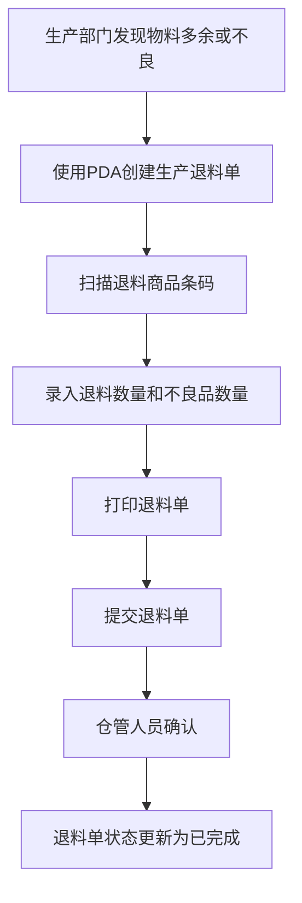
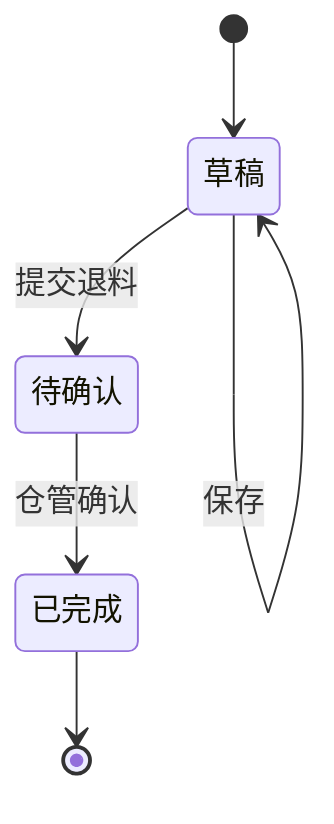

# 《生产退料单》移动端APP产品需求文档

## 一、文档概述

### 1.1 产品背景

生产退料单是配合《领料单》需求上线的PDA单据，旨在将退料环节从传统纸质单据变更为扫码退料，实现退料流程的数字化管理。

### 1.2 产品核心目标

- 简化退料流程，提高工作效率
- 确保物料退料的准确性和可追溯性
- 实现退料过程的数字化管理
- 提供实时的退料状态和结果信息

### 1.3 适用范围

适用于生产部门在领料后发现物料多余或需要更换时进行退料的场景，主要用户为生产人员和仓管人员。

### 1.4 术语与缩写说明

- VSN：物料唯一标识码
- PDA：掌上电脑，用于仓库扫码操作
- TLD：生产退料单
- 源位置：物料的来源位置，如虚拟仓/生产中心
- 目的库：物料退料的目标仓库，如总部总仓

### 1.5 需求优先级定义说明

- 【P0-核心必做】：核心功能，必须实现，直接影响产品正常使用
- 【P1-重要迭代】：重要功能，影响用户体验但不影响核心流程
- 【P2-远期优化】：优化功能，可在后续版本中实现

### 1.6 业务流程图

### 1.7 单据状态机

#### 1.7.1 状态定义

| 状态  | 状态码       | 描述            |
| --- | --------- | ------------- |
| 草稿  | DRAFT     | 退料单已创建但未提交    |
| 待确认 | PENDING   | 退料单已提交，等待仓管确认 |
| 已完成 | COMPLETED | 退料单已确认        |

#### 1.7.2 状态流转规则

#### 1.7.3 状态流转触发条件

| 流转      | 触发条件         | 操作权限 |
| ------- | ------------ | ---- |
| 草稿→待确认  | 用户点击"提交退料"按钮 | 生产人员 |
| 待确认→已完成 | 仓管人员确认       | 仓管人员 |

### 1.8 消息提醒

#### 1.8.1 提醒场景

- 当生产退料单提交后，系统会自动推送消息提醒给仓管人员

#### 1.8.2 提醒内容

- 标题：新生产退料单待处理
- 内容：您有一张新生产退料单需要处理，单号：\[退料单号]，请及时查看并处理
- 跳转：点击消息直接跳转到该退料单详情页面

#### 1.8.3 提醒方式

- PDA端消息通知
- 声音提醒
- 消息中心列表展示

### 1.9 输入控件规范说明

#### 1.9.1 选择框类型说明

| 控件类型 | 说明 | 使用场景 |
|----------|------|----------|
| 下拉选择框 | 点击后从下方弹出选项列表，仅支持单选（只能选择1个选项），下拉列表最多一次性显示5个选项，超出部分需点击"更多"查看 | 选项较少（≤10个）的场景，如制单人、仓管人员等 |
| 点击选择框 | 点击后跳转新页面或弹出弹窗选择，支持单选/多选 | 选项较多（>10个）或需要搜索的场景 |

#### 1.9.2 文本内容换行规则

- 单行显示：选择框选中的内容在一行内显示，超出部分用"..."省略
- 下拉选项：下拉列表最多一次性显示5个选项，超出部分需点击"更多"查看，单个选项内容最多显示1行，超出部分用"..."省略
- 输入框：自动换行，最多显示3行，超出部分可滚动查看

#### 1.9.3 输入框类型说明

| 控件类型  | 说明                | 使用场景        |
| ----- | ----------------- | ----------- |
| 文本输入框 | 单行文本输入，自动适配内容宽度   | 备注、名称等短文本输入 |
| 文本域   | 多行文本输入，支持换行       | 备注、说明等长文本输入 |
| 数字输入框 | 仅允许输入数字，自动弹出数字键盘  | 数量、金额等数值输入  |
| 日期选择器 | 点击弹出日期选择弹窗，支持选择日期 | 日期选择场景      |

## 二、全局通用规范【P0-核心必做】

### 2.1 页面结构

- **布局**：卡片式设计，顶部导航栏固定，内容区域可滚动，底部操作按钮固定
- **导航栏**：左侧返回按钮、中间页面标题、右侧功能按钮
- **交互**：点击操作按钮/列表项，长按显示更多选项，滑动滚动列表

### 2.2 状态规范

- **加载状态**：显示加载动画
- **空状态**：列表无数据时显示提示
- **成功/失败状态**：操作后显示相应提示

### 2.3 弹窗与Toast

- **确认弹窗**：用于删除、提交等重要操作
- **提示Toast**：轻量级提示，自动消失

### 2.4 权限管理

- **权限来源**：后台权限系统
- **权限控制**：按角色分配功能访问权限
- **权限验证**：操作前验证用户权限

### 2.5 系统适配

- PDA默认使用安卓系统
- 使用安卓原生控件样式，如导航栏、按钮等

## 三、核心功能模块需求详情

### 3.1 退料单列表【P0-核心必做】

#### 3.1.1 模块业务主流程

1. 用户打开退料单列表页面
2. 查看所有退料单信息
3. 使用搜索、筛选、排序功能找到目标退料单
4. 点击列表项查看退料单详情（已完成跳转查看页面，待处理跳转新增页面）
5. 点击新增按钮创建新退料单

#### 3.1.2 子页面需求详情

##### 3.1.2.1 退料单列表页面【P0-核心必做】

###### 3.1.2.1.1 页面概述

展示所有退料单的列表，包含单号、状态、退料日期等信息，支持搜索、筛选和排序功能。

###### 3.1.2.1.2 页面前置条件

- 用户已登录系统
- 网络连接正常

###### 3.1.2.1.3 页面后置条件

- 点击列表项，已完成的单子跳转到已完成生产退料单页面，待处理的单子跳转到新增生产退料单页面
- 点击新增按钮跳转到新增退料单页面

###### 3.1.2.1.4 【原型描述】页面整体布局与全控件详情

- 顶部导航栏：
  - 左侧：返回按钮
  - 中间：页面标题"生产退料单"
  - 右侧：无
- 搜索区域：
  - 搜索框：文本输入框，占位符"输入退料单号/VSN进行检索"，单行显示，超出部分省略
  - 右侧：排序按钮和筛选按钮
- 统计信息区域：
  - 左侧：今日数量（取自列表合计今日退料数量）
  - 右侧：今日单据数量（取自列表合计，今天单据的数量）
- 列表区域：
  - 列表项：
    - 头部：
      - 左侧：退料单号
      - 右侧：状态标签（待处理/已完成）
    - 详情：
      - 退料日期（显示退料单创建日期）
      - 制单人（显示退料单制单人）
      - 总退料数（显示退料总数量）
    - 操作按钮：
      - 查看按钮：点击跳转到退料单详情页
      - 处理按钮（仅待处理状态显示）
- 新增按钮：
  - 位于页面底部，显示"+ 新增退料单"

###### 3.1.2.1.5 核心交互流程说明

1. 搜索：在搜索框输入退料单号，系统实时显示匹配结果
2. 筛选：点击筛选按钮，从右侧滑出筛选抽屉，选择状态（待处理/已完成）进行筛选
3. 排序：点击排序按钮，弹出排序选项菜单，选择排序方式（创建时间正序、创建时间倒序）。默认按照创建时间倒序排序
4. 查看详情：点击列表项，已完成的单子跳转到已完成生产退料单页面，待处理的单子跳转到新增生产退料单页面
5. 处理：点击处理按钮，处理待处理状态的单子

###### 3.1.2.1.6 异常场景与处理逻辑

- 无网络连接：显示网络异常提示，点击重试按钮重新加载
- 无数据：显示空状态提示，提示用户暂无退料单

###### 3.1.2.1.7 功能验收标准

- 搜索功能：输入退料单号后，列表实时显示匹配结果
- 筛选功能：选择状态后，列表显示对应状态的退料单
- 排序功能：选择排序方式后，列表按照指定方式排序
- 跳转功能：点击列表项，已完成的单子成功跳转到已完成生产退料单页面，待处理的单子成功跳转到新增生产退料单页面，点击新增按钮成功跳转到新增页面

### 3.2 退料单详情【P0-核心必做】

#### 3.2.1 模块业务主流程

1. 生产部门打开退料单页面
2. 编辑基本信息（退料日期、制单人等）
3. 扫描物料条码进行退料
4. 录入退料数量和不良品数量
5. 关联收货单（可选）
6. 提交退料单

#### 3.2.2 子页面需求详情

##### 3.2.2.1 退料单详情页面【P0-核心必做】

###### 3.2.2.1.1 页面概述

用于创建和查看退料单，包含基本信息编辑、物料扫码退料、结果录入等功能。

###### 3.2.2.1.2 页面前置条件

- 用户已登录系统
- 网络连接正常

###### 3.2.2.1.3 页面后置条件

- 保存草稿：退料单保存为草稿状态
- 提交退料：退料单提交成功，跳转到查看页面

###### 3.2.2.1.4 【原型描述】页面整体布局与全控件详情

- 顶部导航栏：
  - 左侧：返回按钮
  - 中间：页面标题"生产退料单"
  - 右侧：菜单按钮（保存为草稿、设置）
- 信息展示区域：
  - 退料单号：文本显示，系统自动生成，只读
  - 退料日期：日期选择器，默认值为当前日期，必填
  - 制单人：下拉选择框，默认为当前账号登录人，必填，选项超出一行时单行显示省略
  - 仓管人员：下拉选择框，必填，选项超出一行时单行显示省略
  - 单据状态：标签，显示"待处理"或"已完成"
- 扫描区域：
  - 扫描按钮：显示"扫描退料商品条码"，右侧显示"按实体键扫描"
  - 搜索框：文本输入框，占位符"手动输入商品编码/条码"，单行显示
- 退料明细区域：
  - 退料项分组展示：
    - 唯一码商品：
      - 头部：序号、物料编码、物料名称、单位、类型
      - 数量信息：退料总数量固定为1（不可编辑）、合格数、不良数
      - 表格：包含VSN、库位、目的库、操作列（打印🖨️、删除）
        - VSN：文本显示，显示物料唯一标识码
        - 库位：下拉选择框，显示物料存放位置，选项超出一行时单行显示省略
        - 目的库：下拉选择框，显示退料目标仓库，选项超出一行时单行显示省略
      - 状态：显示"已退料"标签
    - 商品码商品：
      - 头部：序号、物料编码、物料名称、单位、类型
      - 数量信息：退料总数量、合格数、不良数（均可输入，数字输入框）
      - 表格：包含产品类型、源位置、目的位置、操作列（打印🖨️、删除）
        - 产品类型：文本显示
        - 源位置：下拉选择框，显示物料来源位置，选项超出一行时单行显示省略
        - 目的位置：下拉选择框，显示退料目标位置，选项超出一行时单行显示省略
      - 状态：显示"已退料"标签
- 空状态：
  - 请继续扫描退料商品VSN码
  - 已添加 X 个退料商品
- 统计信息：
  - 总退料数：显示退料总数量
  - 不良品数：显示不良品总数量
- 底部操作区域（新增页面）：
  - 左侧：取消按钮
  - 中间：打印单据按钮（点击弹窗提示后调用浏览器打印功能）
  - 右侧：提交退料按钮
- 底部操作区域（已完成页面）：
  - 打印单据按钮（点击弹窗提示后调用浏览器打印功能）
- 物料项操作按钮：
  - 打印图标（🖨️）：点击后弹窗提示"打印标签"
- 设置功能：点击设置按钮，弹出字段自定义弹窗，支持字段显示/隐藏和排序
- 退料校验：
  - 已使用的物料不允许退料
  - 退料数量不能超过可用数量
  - 退料数量必须大于0
- 退料单来源：可以由领料单下推得来，也可以新建
- 多领料单关联：一个退料单可以关联多个领料单

###### 3.2.2.1.5 核心交互流程说明

1. 编辑基本信息：修改退料日期、制单人等
2. 扫描物料：点击扫描按钮，启动摄像头扫描物料条码
3. 搜索物料：在搜索框输入物料编码或VSN码，显示匹配结果
4. 批量增加明细：点击批量增加明细按钮，批量添加退料明细
5. 关联收货单：点击关联收货单按钮，关联相关收货单
6. 提交退料：点击提交退料按钮，系统验证信息并提交，跳转到已完成页面
7. 取消：点击取消按钮，取消退料操作
8. 打印单据：点击打印单据按钮，弹窗提示后调用浏览器打印功能打印当前页面
9. 打印标签：点击物料项的打印图标，弹窗提示打印标签
10. 设置：点击设置按钮，打开字段自定义弹窗

###### 3.2.2.1.6 异常场景与处理逻辑

- 扫描失败：显示扫描失败提示，提示用户重新扫描
- 搜索无结果：显示无结果提示，提示用户检查输入
- 提交时无物料：显示提示，要求用户至少添加一个物料
- 保存为草稿后不可删除：退料单保存为草稿状态（PDA草稿）后，在PDA上不可删除该单据，只能继续编辑或提交

###### 3.2.2.1.7 功能验收标准

- 基本信息编辑：成功修改退料日期、制单人等
- 物料添加：成功通过扫描或搜索添加物料
- 退料数量录入：成功录入退料数量和不良品数量
- 保存功能：成功保存草稿，状态变为"待处理（PDA草稿）"
- 提交功能：成功提交退料单并跳转到查看页面
- 打印功能：成功调用浏览器打印功能

## 四、非功能需求规范

### 4.1 性能需求

- 页面加载时间：冷启动≤2s，热启动≤1s
- 操作响应时间：点击操作≤500ms，扫描操作≤2s
- 网络超时：弱网环境下请求超时时间≤10s，超时后显示网络异常状态

### 4.2 兼容性需求

- 支持Android 6.0及以上版本
- 适配不同屏幕尺寸，优先考虑移动设备使用场景

### 4.3 安全需求

- 数据传输加密：所有网络请求使用HTTPS
- 用户认证：使用token进行身份验证
- 权限控制：不同角色有不同的操作权限

### 4.4 其他非功能需求

- 可维护性：代码结构清晰，易于维护
- 可扩展性：支持后续功能扩展
- 可测试性：代码可单元测试，功能可集成测试

## 五、附录

### 5.1 其他补充说明

- 本需求文档基于现有HTML原型和业务流程编写
- 后续可根据实际使用情况进行功能优化和扩展
- 建议在正式上线前进行用户测试，收集反馈后再进行调整

