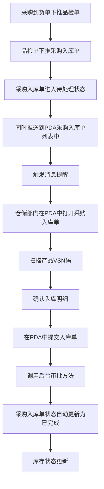

# 《采购入库单》移动端APP产品需求文档

## 一、文档概述

### 1.1 产品背景

随着企业业务的发展，采购入库流程的效率和准确性对企业运营至关重要。传统的手工记录和纸质单据管理方式存在效率低下、容易出错、难以追溯等问题。为了解决这些问题，开发采购入库单移动端APP，实现采购入库流程的数字化、自动化管理，提高工作效率和数据准确性。

### 1.2 产品核心目标

- 实现采购入库单的数字化管理，减少人工操作，提高工作效率
- 支持VSN码扫描功能，确保产品信息的准确性和可追溯性
- 提供实时库存数据，便于库存管理和决策
- 支持打印功能，满足企业对纸质单据的需求
- 实现采购入库流程的标准化和规范化

### 1.3 适用范围

本产品适用于企业内部的采购入库管理，主要用户为仓库管理员、采购人员等相关人员。

### 1.4 术语与缩写说明

| 术语    | 缩写       | 说明                 |
| ----- | -------- | ------------------ |
| 采购入库单 | PJD      | 记录采购物品入库信息的单据      |
| VSN码  | VSN      | 产品唯一标识码，用于追踪产品信息   |
| 源单编号  | PR       | 采购请求单编号，采购入库单的来源单据 |
| 物料编码  | SKU      | 物料的唯一标识符           |
| 入库仓位  | Location | 物品存放的具体位置          |

### 1.5 业务流程图

### 1.6 消息提醒

#### 1.6.1 提醒场景

- 当采购部门在VPS系统中创建采购请求单并生成采购入库单后，系统会自动推送消息提醒给仓储部门

#### 1.6.2 提醒内容

- 标题：新采购入库单待处理
- 内容：您有一张新的采购入库单需要处理，单号：[入库单号]，请及时查看并处理
- 跳转：点击消息直接跳转到该采购入库单详情页面

#### 1.6.3 提醒方式

- PDA端消息通知
- 声音提醒
- 消息中心列表展示

## 二、全局通用规范

### 2.1 全局页面结构规范

- 所有页面采用移动端APP标准布局，包含头部导航栏、主体内容区、底部操作区（如需要）
- 页面布局应适应不同屏幕尺寸，确保在安卓和iOS设备上都能正常显示
- 页面内容应简洁明了，重点突出核心功能

### 2.2 导航栏通用规则

- 导航栏位于页面顶部，包含返回按钮、页面标题、右侧操作按钮（如需要）
- 返回按钮：点击返回上一页
- 页面标题：显示当前页面名称
- 右侧操作按钮：根据页面功能提供相应的操作，如保存、设置等

### 2.3 通用弹窗与Toast规范

- 弹窗：用于需要用户确认的操作，如删除、提交等
- Toast：用于操作成功或失败的提示，显示时间约2秒
- 加载弹窗：用于加载数据时的提示，避免用户重复操作

### 2.4 通用状态规范

- 加载状态：显示加载动画，提示用户系统正在处理
- 空状态：当没有数据时，显示空状态提示，引导用户进行操作
- 成功状态：操作成功后显示成功提示，如Toast或成功页面
- 失败状态：操作失败后显示失败提示，说明失败原因

## 三、核心功能模块需求详情

### 3.1 采购入库单管理

#### 3.1.1 模块概述

采购入库单管理模块是本产品的核心功能，用于创建、编辑、查看采购入库单，记录采购物品的入库信息。

#### 3.1.2 模块业务主流程

1. 用户进入采购入库单页面
2. 填写入库单基本信息
3. 扫描或手动输入产品VSN码
4. 确认入库明细
5. 提交入库单
6. 打印入库单（如有需要）

#### 3.1.3 子页面需求详情

##### 3.1.3.1 采购入库单页面

###### 3.1.3.1.1 页面概述

采购入库单页面用于创建和编辑采购入库单，包含入库单基本信息、VSN码扫描区域、入库明细等内容。

###### 3.1.3.1.2 页面布局与控件

- 头部导航栏：
  - 返回按钮：点击返回上一页
  - 页面标题：显示"采购入库单"
  - 右侧操作按钮：包含"保存为草稿"和"设置"按钮
- 入库单信息区域：
  - 入库单号：显示系统生成的入库单号，不可编辑
  - 安排日期：日期选择器，可选择入库日期
  - 源单编号：显示采购请求单编号，不可编辑
  - 入库类型：显示"采购入库"，不可编辑
  - 物料状态：下拉选择框，可选择"良品"或"不良品"
  - 目的位置：显示入库位置，不可编辑
- 扫描产品条码区域：
  - 标题：显示"扫描产品条码"
  - 扫描按钮：点击打开扫描界面
  - 手动输入框：用于搜索产品编码或名称
  - 添加按钮：点击添加手动输入的产品
- 入库明细区域：
  - 标题：显示"入库明细"
  - 唯一码商品：显示唯一码商品的详细信息，包含物料编码、物料名称、单位、类型、应入库数量、可用数量
  - 商品码商品：显示商品码商品的详细信息，包含物料编码、物料名称、单位、类型、应入库数量、可用数量
  - 明细表格：显示VSN、库位、入库数量、入库仓位、操作
  - 添加更多产品按钮：点击继续扫描产品VSN码
- 汇总信息区域：
  - 入库总数：显示入库总数量
- 需求/实际占比区域：
  - 应入/实入：显示应入库数量和实际入库数量，格式为"应入/实入：[应入库数量]/[实际入库数量]"
- 打印按钮区域：
  - 实入数量：显示实际入库数量
  - 打印按钮：点击跳转到打印确认页面
  - 确认入库按钮：点击提交入库单

###### 3.1.3.1.3 核心交互流程

1. 用户进入采购入库单页面
2. 填写安排日期和物料状态
3. 点击扫描按钮或手动输入VSN码，添加产品到入库明细
4. 修改入库数量和入库仓位（如有需要）
5. 点击确认入库按钮，提交入库单
6. 点击打印按钮，跳转到打印确认页面

###### 3.1.3.1.4 异常场景与处理

- 扫描无效VSN码：显示"无效的VSN码"提示
- 入库数量超过可用数量：显示"入库数量不能超过可用数量"提示
- 网络连接失败：显示"网络连接失败，请检查网络设置"提示
- 提交失败：显示"提交失败，请重试"提示

##### 3.1.3.2 采购入库单列表页面

###### 3.1.3.2.1 页面概述

采购入库单列表页面用于显示采购入库单的列表，用户可以查看、搜索、筛选采购入库单。

###### 3.1.3.2.2 页面布局与控件

- 头部导航栏：
  - 返回按钮：点击返回上一页
  - 页面标题：显示"采购入库单列表"
- 搜索和操作区域：
  - 新建按钮：点击跳转到采购入库单页面
  - 搜索框：输入单据编号或VSN进行检索
  - 排序下拉框：选择排序方式，包括创建时间倒序和创建时间正序
  - 筛选下拉框：选择状态筛选，包括待处理、已完成、审批中、草稿
- 统计信息区域：
  - 今日数量：显示今日入库数量
  - 今日单据数量：显示今日入库单据数量
- 单据列表：
  - 单据项：包含单据编号、状态、作业类型、创建时间、制单人、操作按钮
  - 状态标签：显示单据状态（待处理、已完成、审批中、草稿）
  - 操作按钮：包含打印
- 分页区域：
  - 上一页按钮：点击跳转到上一页
  - 页码显示：显示当前页码和总页数
  - 下一页按钮：点击跳转到下一页

###### 3.1.3.2.3 核心交互流程

1. 用户进入采购入库单列表页面
2. 查看采购入库单列表
3. 点击新建按钮，跳转到采购入库单页面
4. 输入搜索条件，进行搜索
5. 点击排序下拉框，选择排序方式
6. 点击筛选下拉框，选择状态筛选
7. 点击单据项，查看详情
8. 点击打印按钮，打印采购入库单
9. 点击分页按钮，切换页码

###### 3.1.3.2.4 异常场景与处理

- 搜索无结果：显示"没有找到符合条件的采购入库单"提示
- 网络连接失败：显示"网络连接失败，请检查网络设置"提示

##### 3.1.3.3 采购入库单详情页面

###### 3.1.3.3.1 页面概述

采购入库单详情页面用于查看采购入库单的详细信息，包含入库单基本信息、入库明细等内容。

###### 3.1.3.3.2 页面布局与控件

- 头部导航栏：
  - 返回按钮：点击返回上一页
  - 页面标题：显示"采购入库单详情"
- 入库单信息区域：
  - 入库单号：显示系统生成的入库单号
  - 安排日期：显示入库日期
  - 源单编号：显示采购请求单编号
  - 入库类型：显示"采购入库"
  - 物料状态：显示选择的物料状态
  - 目的位置：显示入库位置
- 入库明细区域：
  - 标题：显示"入库明细"
  - 商品信息：显示商品的详细信息，包含物料编码、物料名称、单位、类型、应入库数量、可用数量
  - 明细表格：显示VSN、库位、入库数量、入库仓位、操作
- 汇总信息区域：
  - 产品数量：显示产品数量
- 打印按钮区域：
  - 实入数量：显示实际入库数量
  - 打印按钮：点击触发打印功能

###### 3.1.3.3.3 核心交互流程

1. 用户进入采购入库单详情页面
2. 查看入库单详细信息
3. 点击打印按钮，打印采购入库单
4. 点击返回按钮，返回采购入库单列表页面

###### 3.1.3.3.4 异常场景与处理

- 网络连接失败：显示"网络连接失败，请检查网络设置"提示

### 3.2 打印管理

#### 3.2.1 模块概述

打印管理模块用于打印采购入库单和标签，满足企业对纸质单据的需求。

#### 3.2.2 模块业务主流程

1. 用户进入打印确认页面
2. 确认打印信息
3. 选择打印类型（单据或标签）
4. 进入打印预览页面
5. 设置打印参数
6. 执行打印

#### 3.2.3 子页面需求详情

##### 3.2.3.1 打印确认页面

###### 3.2.3.1.1 页面概述

打印确认页面用于确认打印信息，选择打印类型。

###### 3.2.3.1.2 页面布局与控件

- 头部导航栏：
  - 返回按钮：点击返回上一页
  - 页面标题：显示"采购入库单"
  - 右侧操作按钮：包含"打印单据"和"打印标签"按钮
- 入库单信息区域：
  - 标题：显示"入库单-采购收货"
  - 源单编号：显示采购请求单编号
  - 单据日期：显示入库日期
  - 制单人：显示制单人姓名
  - 入库单号：显示系统生成的入库单号
  - 物料状态：显示选择的物料状态
  - 入库类型：显示"采购入库"
  - 源单编号扫码：显示源单编号扫码结果
  - 合计：显示入库总数量
- 入库明细区域：
  - 标题：显示"入库明细"
  - 明细表格：显示序号、物料编码、物料名称、物料类别、单位、VSN、应入库数量、入库数量、入库仓位、可用数量、备注
- 汇总信息区域：
  - 入库总数：显示入库总数量

###### 3.2.3.1.3 核心交互流程

1. 用户进入打印确认页面
2. 确认入库单信息
3. 点击"打印单据"按钮，跳转到打印预览页面
4. 点击"打印标签"按钮，弹出打印标签弹窗

###### 3.2.3.1.4 异常场景与处理

- 网络连接失败：显示"网络连接失败，请检查网络设置"提示

##### 3.2.3.2 打印预览页面

###### 3.2.3.2.1 页面概述

打印预览页面用于预览打印内容，设置打印参数。

###### 3.2.3.2.2 页面布局与控件

- 头部导航栏：
  - 返回按钮：点击返回上一页
  - 页面标题：显示"打印预览"
- 打印设置区域：
  - 打印机：下拉选择框，选择打印机
  - 份数：输入框，设置打印份数
  - 布局：单选框，选择纵向或横向
  - 页面：单选框，选择全部或指定页面
  - 颜色：下拉选择框，选择彩色或黑白
  - 打印按钮：点击执行打印
  - 取消按钮：点击返回上一页
- 预览内容区域：
  - 标题：显示"入库单-采购收货"
  - 入库单信息：显示源单编号、单据日期、制单人、入库单号、物料状态、入库类型、源单编号扫码、合计
  - 入库明细：显示序号、物料编码、物料名称、物料类别、单位、VSN、应入库数量、入库数量、入库仓位、可用数量、备注
  - 汇总信息：显示入库总数

###### 3.2.3.2.3 核心交互流程

1. 用户进入打印预览页面
2. 设置打印参数
3. 预览打印内容
4. 点击打印按钮，执行打印
5. 点击取消按钮，返回上一页

###### 3.2.3.2.4 异常场景与处理

- 打印机未连接：显示"打印机未连接，请检查打印机设置"提示
- 打印失败：显示"打印失败，请重试"提示

##### 3.2.3.3 打印标签弹窗

###### 3.2.3.3.1 页面概述

打印标签弹窗用于设置标签打印参数，打印产品标签。

###### 3.2.3.3.2 页面布局与控件

- 弹窗头部：
  - 标题：显示"打印标签"
  - 关闭按钮：点击关闭弹窗
- 选择产品区域：
  - 标题：显示"选择产品"
  - 产品选择：包含复选框、产品名称、数量输入框
- 二维码预览区域：
  - 标题：显示"二维码预览"
  - 二维码信息：显示PJD、ITEM、QTY、VENDOR等信息
  - 二维码：显示产品二维码
- 操作按钮区域：
  - 取消按钮：点击关闭弹窗
  - 打印按钮：点击执行标签打印

###### 3.2.3.3.3 核心交互流程

1. 用户进入打印标签弹窗
2. 选择需要打印标签的产品
3. 设置打印数量
4. 预览二维码
5. 点击打印按钮，执行标签打印
6. 点击取消按钮，关闭弹窗

###### 3.2.3.3.4 异常场景与处理

- 打印机未连接：显示"打印机未连接，请检查打印机设置"提示
- 打印失败：显示"打印失败，请重试"提示

### 3.3 设置管理

#### 3.3.1 模块概述

设置管理模块用于设置采购入库单的显示字段，根据用户需求自定义显示内容。

#### 3.3.2 模块业务主流程

1. 用户进入设置页面
2. 选择需要显示的字段
3. 保存设置
4. 返回采购入库单页面

#### 3.3.3 子页面需求详情

##### 3.3.3.1 设置页面

###### 3.3.3.1.1 页面概述

设置页面用于设置采购入库单的显示字段。

###### 3.3.3.1.2 页面布局与控件

- 头部导航栏：
  - 返回按钮：点击返回上一页
  - 页面标题：显示"设置"
- 设置内容区域：
  - 标题：显示"字段显示设置"
  - 字段选项：包含入库单号、安排日期、源单编号、入库类型、物料状态、目的位置、是否为手机配件等字段的开关

###### 3.3.3.1.3 核心交互流程

1. 用户进入设置页面
2. 开启或关闭需要显示的字段
3. 点击返回按钮，保存设置并返回采购入库单页面

## 四、字段填写逻辑说明

### 4.1 入库单信息区域字段

| 字段名 | 控件类型 | 必填 | 默认值 | 填写逻辑 |
|-------|---------|------|--------|----------|
| 入库单号 | 文本显示 | 否 | 系统自动生成 | 只读，系统根据规则自动生成 |
| 源单据 | 输入框 | 是 | 系统自动带出品检单单据 | 可编辑，系统默认带出品检单单据 |
| 物料状态 | 下拉选择框 | 是 | 良品 | 点击展开选项列表，可选择"良品"或"不良品" |
| 单据日期 | 文本显示 | 否 | 系统自动生成 | 只读，系统根据当前日期生成 |
| 作业类型 | 文本显示 | 否 | 采购入库 | 只读，系统默认显示 |
| 制单人 | 文本显示 | 否 | 当前用户 | 只读，系统自动显示当前登录用户 |
| 安排日期 | 文本显示 | 否 | 系统自动生成 | 只读，系统根据当前日期生成 |
| 目的位置 | 文本显示 | 否 | 系统自动生成 | 只读，系统根据业务规则生成 |
| 部门 | 文本显示 | 否 | 系统自动生成 | 只读，系统根据当前用户所在部门生成 |
| 备注 | 输入框 | 否 | 无 | 可编辑输入，用于记录额外信息 |

### 4.2 扫描产品条码区域字段

| 字段名 | 控件类型 | 必填 | 默认值 | 填写逻辑 |
|-------|---------|------|--------|----------|
| 搜索产品编码或名称 | 输入框 | 否 | 无 | 可输入产品编码或名称进行搜索 |

### 4.3 入库明细区域字段

| 字段名 | 控件类型 | 必填 | 默认值 | 填写逻辑 |
|-------|---------|------|--------|----------|
| 库位 | 下拉选择框 | 是 | 成都总仓 | 点击展开选项列表，可选择库位 |
| 入库数量 | 输入框 | 是 | 1 | 可编辑输入入库数量，默认为1 |
| 入库仓位 | 下拉选择框 | 是 | 成都总仓 | 点击展开选项列表，可选择入库仓位 |

## 五、系统关联说明

由于PDA上的单据信息来源是VPS系统，各种操作也是跟系统打通的，因此一些数量或者逻辑的校验，都跟系统同步，系统上怎么校验的，PDA也是怎么校验。

## 六、其他补充说明

- 本需求文档基于提供的原型图生成，如有与实际业务需求不符的地方，以实际业务需求为准。
- 后续可根据业务需求扩展更多功能，如批量操作、数据导出等。