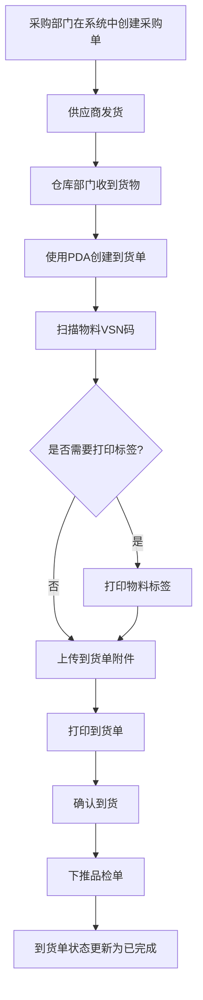
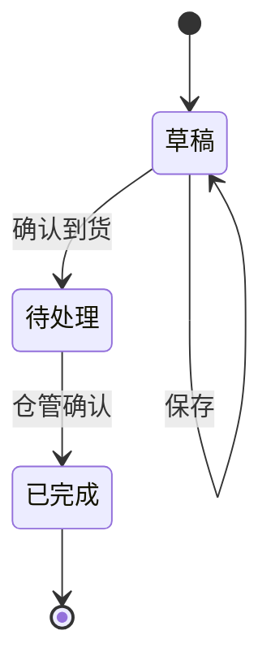

# 《采购到货单》移动端APP产品需求文档

## 一、文档概述

### 1.1 产品背景

采购到货单是配合《一物一码》需求上线的PDA单据，旨在将到货环节从传统纸质单据变更为扫码入库，实现到货流程的数字化管理。

### 1.2 产品核心目标

- 简化到货流程，提高工作效率
- 确保物料管理的准确性和可追溯性
- 实现到货过程的数字化管理
- 提供实时的物料库存和到货状态信息

### 1.3 适用范围

适用于仓库部门处理采购到货的场景，主要用户为仓库管理人员。

### 1.4 术语与缩写说明

- VSN：物料唯一标识码
- PDA：掌上电脑，用于仓库扫码操作

### 1.5 需求优先级定义说明

- 【P0-核心必做】：核心功能，必须实现，直接影响产品正常使用
- 【P1-重要迭代】：重要功能，影响用户体验但不影响核心流程
- 【P2-远期优化】：优化功能，可在后续版本中实现

### 1.6 业务流程图

### 1.7 单据状态机

#### 1.7.1 状态定义

| 状态 | 状态码 | 描述 |
|------|--------|------|
| 草稿 | DRAFT | 到货单已创建但未提交 |
| 待处理 | PENDING | 到货单已提交，等待仓管确认 |
| 已完成 | COMPLETED | 到货单已确认并下推品检单 |

#### 1.7.2 状态流转规则

#### 1.7.3 状态流转触发条件

| 流转 | 触发条件 | 操作权限 |
|------|----------|----------|
| 草稿→待处理 | 用户点击"确认到货"按钮 | 仓库操作员 |
| 待处理→已完成 | 系统自动确认 | 系统 |

### 1.8 消息提醒

#### 1.8.1 提醒场景

- 当采购部门在系统中下推采购收货单后，系统会自动推送消息提醒给仓库部门

#### 1.8.2 提醒内容

- 标题：新采购到货单待处理
- 内容：您有一张新的采购到货单需要处理，单号：\[采购到货单号]，请及时查看并处理
- 跳转：点击消息直接跳转到该采购到货单详情页面

#### 1.8.3 提醒方式

- PDA端消息通知
- 声音提醒
- 消息中心列表展示

### 1.9 输入控件规范说明

#### 1.9.1 选择框类型说明

| 控件类型 | 说明 | 使用场景 |
|----------|------|----------|
| 下拉选择框 | 点击后从下方弹出选项列表，仅支持单选（只能选择1个选项），下拉列表最多一次性显示5个选项，超出部分需点击"更多"查看 | 选项较少（≤10个）的场景，如供应商、制单人等 |
| 点击选择框 | 点击后跳转新页面或弹出弹窗选择，支持单选/多选 | 选项较多（>10个）或需要搜索的场景 |

#### 1.9.2 文本内容换行规则

- 单行显示：选择框选中的内容在一行内显示，超出部分用"..."省略
- 下拉选项：下拉列表最多一次性显示5个选项，超出部分需点击"更多"查看，单个选项内容最多显示1行，超出部分用"..."省略
- 输入框：自动换行，最多显示3行，超出部分可滚动查看

#### 1.9.3 输入框类型说明

| 控件类型 | 说明 | 使用场景 |
|----------|------|----------|
| 文本输入框 | 单行文本输入，自动适配内容宽度 | 备注、名称等短文本输入 |
| 文本域 | 多行文本输入，支持换行 | 备注、说明等长文本输入 |
| 数字输入框 | 仅允许输入数字，自动弹出数字键盘 | 数量、金额等数值输入 |
| 日期选择器 | 点击弹出日期选择弹窗，支持选择日期 | 日期选择场景 |

## 二、全局通用规范【P0-核心必做】

### 2.1 页面结构
- **布局**：卡片式设计，顶部导航栏固定，内容区域可滚动，底部操作按钮固定
- **导航栏**：左侧返回按钮、中间页面标题、右侧功能按钮
- **交互**：点击操作按钮/列表项，长按显示更多选项，滑动滚动列表

### 2.2 状态规范
- **加载状态**：显示加载动画
- **空状态**：列表无数据时显示提示
- **成功/失败状态**：操作后显示相应提示

### 2.3 弹窗与Toast
- **确认弹窗**：用于删除、提交等重要操作
- **提示Toast**：轻量级提示，自动消失

### 2.4 权限管理
- **权限来源**：后台权限系统
- **权限控制**：按角色分配功能访问权限，仓库操作员只能查看和处理到货单，采购部门只能创建采购单，和VPS后台权限一致。
- **权限验证**：操作前验证用户权限

### 2.5 系统适配

- PDA默认使用安卓系统
- 使用安卓原生控件样式，如导航栏、按钮等

## 三、核心功能模块需求详情

### 3.1 采购到货单列表【P0-核心必做】

#### 3.1.1 模块业务主流程

1. 用户打开到货单列表页面
2. 查看所有到货单信息
3. 使用搜索、筛选、排序功能找到目标到货单
4. 点击列表项查看到货单详情
5. 点击新增按钮创建新的到货单

#### 3.1.2 子页面需求详情

##### 3.1.2.1 采购到货单列表页面【P0-核心必做】

###### 3.1.2.1.1 页面概述

展示所有到货单的列表，包含单号、状态、供应商等信息，支持搜索、筛选和排序功能。

###### 3.1.2.1.2 页面前置条件

- 用户已登录系统
- 网络连接正常

###### 3.1.2.1.3 页面后置条件

- 点击列表项跳转到查看到货单页面
- 点击新增按钮跳转到新增到货单页面

###### 3.1.2.1.4 【原型描述】页面整体布局与全控件详情

- 顶部导航栏：
  - 左侧：返回按钮
  - 中间：页面标题"采购到货单列表"
  - 右侧：无
- 搜索区域：
  - 搜索框：文本输入框，占位符"输入单据编号/VSN进行检索"，单行显示，超出部分省略
  - 右侧：排序按钮和筛选按钮
- 统计信息区域：
  - 左侧：今日数量（取自列表合计今日到货数量）
  - 右侧：今日单据数量（取自列表合计，今天单据的数量）
- 列表区域：
  - 列表项：
    - 头部：
      - 左侧：到货单号
      - 右侧：状态标签（待处理/已完成）
    - 详情：
      - 供应商（显示供应商名称）
      - 创建时间（系统自动生成，记录单据创建时间）
    - 操作按钮：
      - 打印按钮：点击跳转到采购到货单详情页
      - 去处理按钮（仅待处理状态显示）

###### 3.1.2.1.5 核心交互流程说明

1. 搜索：在搜索框输入到货单号，系统实时显示匹配结果
2. 筛选：点击筛选按钮，从右侧滑出筛选抽屉，选择状态（待处理/已完成）进行筛选
3. 排序：点击排序按钮，弹出排序选项菜单，选择排序方式（创建时间正序、创建时间倒序）。默认按照创建时间倒序排序，最近的在上面，最远的在下面
4. 查看详情：点击列表项，根据状态跳转：
   - 已完成状态：跳转到查看采购到货单页面
   - 待处理状态：跳转到新增采购到货单页面（处理页面）
5. 去处理：点击去处理按钮，跳转到新增采购到货单页面处理待处理状态的单子

###### 3.1.2.1.6 异常场景与处理逻辑

- 无网络连接：显示网络异常提示，点击重试按钮重新加载
- 无数据：显示空状态提示，提示用户暂无到货单

###### 3.1.2.1.7 功能验收标准

- 搜索功能：输入到货单号后，列表实时显示匹配结果
- 筛选功能：选择状态后，列表显示对应状态的到货单
- 排序功能：选择排序方式后，列表按照指定方式排序
- 跳转功能：点击列表项成功跳转到查看页面，点击新增按钮成功跳转到新增页面

### 3.2 采购到货单详情【P0-核心必做】

#### 3.2.1 模块业务主流程

1. 仓库部门打开到货单页面
2. 编辑基本信息（供应商、采购单号、到货日期）
3. 扫描物料条码添加物料
4. 上传到货单附件
5. 点击打印单据按钮进行打印

#### 3.2.2 子页面需求详情

##### 3.2.2.1 采购到货单详情页面【P0-核心必做】

###### 3.2.2.1.1 页面概述

用于创建和查看到货单，包含基本信息编辑、物料扫码添加、附件上传、打印单据等功能。

###### 3.2.2.1.2 页面前置条件

- 用户已登录系统
- 网络连接正常

###### 3.2.2.1.3 页面后置条件

- 保存草稿：到货单保存为草稿状态
- 打印单据：触发打印功能

###### 3.2.2.1.4 【原型描述】页面整体布局与全控件详情

- 顶部导航栏：
  - 左侧：返回按钮
  - 中间：页面标题"采购到货单"
  - 右侧：保存为草稿按钮、设置按钮
- 信息编辑区域：
  - 到货单号：文本显示，系统自动生成，只读
  - 供应商：下拉选择框，系统自动带出，必填，仅限选择一项，超出边框部分省略
  - 采购单号：下拉选择框，系统自动带出，必填，仅限选择一项
  - 到货日期：日期选择器，默认值为当前日期，必填
  - 制单人：下拉选择框，默认值为当前用户，必填，仅限选择一项
  - 备注：文本域，非必填，最多显示3行，超出部分可滚动
- 扫描区域：
  - 扫描按钮：显示"扫描商品条码"，右侧显示"按实体键扫描"
  - 搜索框：文本输入框，占位符"搜索商品编码/名称"，单行显示
- 物料列表区域：
  - 物料项：
    - 头部：
      - 左侧：序号
      - 右侧：物料编码
    - 详情：
      - 左侧：物料图片
      - 右侧：
        - 物料信息：物料名称、单位、类型（唯一码商品/商品码商品）
        - 数量信息：应到数量、实到数量
        - 表格：
          - 唯一码商品表头：VSN、库位、实到、操作
          - 商品码商品表头：库位、实到、操作（无VSN列）
          - 表体：
            - VSN：文本显示，仅唯一码商品有VSN码，格式为V+8位数字
            - 库位：下拉选择框，系统带出（默认：待检仓(二楼)/库存），选项超出一行时单行显示省略
            - 实到：
              - 唯一码商品：数字显示，固定为1，不可编辑
              - 商品码商品：数字输入框，默认带出应到数量，允许用户手动输入实到数量
            - 操作：
              - 唯一码商品：打印按钮、删除按钮
              - 商品码商品：打印按钮、删除按钮
- 查看全部VSN按钮：唯一码商品显示，点击跳转到VSN列表下级页面，支持查看大量VSN数据（如一次性到货几百个唯一码商品的情况）
- 统计区域：
  - 总数量：显示总到货数量
  - 已扫：显示已扫描数量和总到货数量
- 底部操作区域（新增页面）：
  - 打印单据按钮：点击后弹窗提示"打印到货单"，然后调用浏览器打印功能打印当前单据页面
  - 确认到货按钮：点击后确认到货，跳转到已完成采购到货单页面
- 底部操作区域（已完成页面）：
  - 下推品检单按钮：点击后弹窗提示已下推品检单，品检人员将收到消息提醒处理品检
  - 打印单据按钮：点击后弹窗提示"打印到货单"，然后调用浏览器打印功能打印当前单据页面
- 物料项操作按钮：
  - 打印图标（🖨️）：点击后弹窗提示"打印标签"

###### 3.2.2.1.5 核心交互流程说明

1. 编辑基本信息：修改供应商、采购单号和到货日期
2. 扫描物料：点击扫描按钮，启动摄像头扫描物料条码
3. 搜索物料：在搜索框输入物料编码或名称，显示匹配结果
4. 删除物料：点击删除按钮，确认后删除物料
5. 上传附件：点击拍照上传附件按钮，拍摄并上传附件
6. 保存草稿：点击保存按钮，保存当前编辑内容
7. 打印单据：点击打印单据按钮，弹窗提示后调用浏览器打印功能打印当前页面
8. 打印标签：点击物料项的打印图标，弹窗提示打印标签
9. 确认到货：点击确认到货按钮，确认到货并跳转到已完成采购到货单页面
10. 下推品检单（已完成页面）：点击下推品检单按钮，弹窗提示已下推，品检人员收到消息提醒

###### 3.2.2.1.6 异常场景与处理逻辑

- 扫描失败：显示扫描失败提示，提示用户重新扫描
- 搜索无结果：显示无结果提示，提示用户检查输入
- 提交时无物料：显示提示，要求用户至少添加一个物料
- 保存为草稿后不可删除：到货单保存为草稿状态（PDA草稿）后，在PDA上不可删除该单据，只能继续编辑或提交

###### 3.2.2.1.7 功能验收标准

- 基本信息编辑：成功修改供应商、采购单号和到货日期
- 物料添加：成功通过扫描或搜索添加物料
- 附件上传：成功上传到货单附件
- 保存功能：成功保存草稿，状态变为"待处理（PDA草稿）"
- 删除功能：PDA草稿状态的单据不可删除
- 打印功能：成功跳转到打印预览页面

### 3.3 VSN列表页面【P1-重要迭代】

#### 3.3.1 页面概述

用于查看唯一码商品的所有VSN信息，解决一次性到货大量唯一码商品（如几百个）在PDA页面无法完整展示的问题。

#### 3.3.2 页面前置条件

- 用户已登录系统
- 网络连接正常
- 已进入采购到货单详情页面
- 当前物料为唯一码商品

#### 3.3.3 页面后置条件

- 返回：返回到采购到货单详情页面
- 确认：确认VSN信息后返回到采购到货单详情页面

#### 3.3.4 页面布局与控件详情

- 顶部导航栏：
  - 左侧：返回按钮
  - 中间：页面标题"VSN列表"
- 物料信息栏：显示物料名称、物料编码、应到数量
- 搜索区域：搜索框，文本输入框，支持按VSN码搜索，单行显示
- 统计信息：显示总记录数和当前显示范围
- VSN表格：包含序号、VSN、库位、实到、操作列
  - 序号：显示当前页序号（全局序号）
  - VSN：显示物料唯一标识码，格式为V+8位数字（如V00000001）
  - 库位：下拉选择框，显示物料存放位置，选项超出一行时单行显示省略
  - 实到：数字显示，默认值为1（唯一码商品）
  - 操作：打印按钮、删除按钮
- 分页区域：
  - 上一页按钮：点击跳转到上一页（第一页时禁用）
  - 页码信息：显示当前页码/总页数
  - 下一页按钮：点击跳转到下一页（最后一页时禁用）
- 底部操作栏：
  - 返回按钮：返回上一页
  - 确认按钮：确认VSN信息

#### 3.3.5 核心交互流程说明

1. 进入页面：点击"查看全部VSN"按钮进入
2. 搜索VSN：在搜索框输入VSN码，实时过滤显示（搜索时重置到第一页）
3. 分页浏览：点击上一页/下一页按钮切换页面
4. 打印标签：点击打印按钮打印单个VSN标签
5. 删除记录：点击删除按钮删除指定VSN记录
6. 返回：点击返回按钮回到采购到货单详情页面
7. 确认：点击确认按钮确认VSN信息并返回

#### 3.3.6 功能验收标准

- 页面跳转：成功从采购到货单详情页面跳转到VSN列表页面
- 搜索功能：输入VSN码后实时过滤显示匹配结果
- 分页功能：成功切换上一页/下一页，第一页上一页按钮禁用，最后一页下一页按钮禁用
- 打印功能：成功打印单个VSN标签
- 删除功能：成功删除指定VSN记录
- 返回功能：成功返回到采购到货单详情页面

## 四、非功能需求规范

### 4.1 性能需求

- 页面加载时间：冷启动≤2s，热启动≤1s
- 操作响应时间：点击操作≤500ms，扫描操作≤2s
- 网络超时：弱网环境下请求超时时间≤10s，超时后显示网络异常状态

### 4.2 兼容性需求

- 支持Android 6.0及以上版本
- 适配不同屏幕尺寸，优先考虑移动设备使用场景

### 4.3 安全需求

- 数据传输加密：所有网络请求使用HTTPS
- 用户认证：使用token进行身份验证
- 权限控制：不同角色有不同的操作权限

### 4.4 其他非功能需求

- 可维护性：代码结构清晰，易于维护
- 可扩展性：支持后续功能扩展
- 可测试性：代码可单元测试，功能可集成测试

## 五、附录

### 5.1 其他补充说明

- 本需求文档基于现有HTML原型和业务流程编写
- 后续可根据实际使用情况进行功能优化和扩展
- 建议在正式上线前进行用户测试，收集反馈后再进行调整