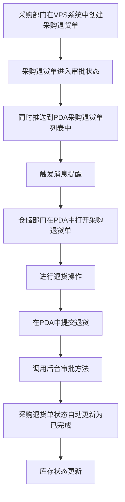

# 《采购退货单》移动端APP产品需求文档

## 一、文档概述

### 1.1 产品背景

采购退货单是配合采购流程管理的PDA单据，旨在将采购退货环节从传统纸质单据变更为数字化管理，实现采购退货流程的规范化和可追溯性。传统的采购退货流程依赖纸质单据，存在效率低下、容易出错、难以追溯等问题，通过数字化管理，可以有效解决这些问题，提高工作效率，确保采购退货管理的准确性和可追溯性。

### 1.2 产品核心目标

- 简化采购退货流程，提高工作效率
- 确保采购退货管理的准确性和可追溯性
- 实现采购退货过程的数字化管理
- 提供实时的退货状态和库存信息

### 1.3 适用范围

适用于采购入库后需要退回供应商的场景，主要用户为采购部门和仓库管理人员。

### 1.4 术语与缩写说明

- VSN：物料唯一标识码
- PDA：掌上电脑，用于仓库扫码操作
- CGT：采购退货单编号前缀
- PO：采购订单编号前缀
- RKD：入库单编号前缀

### 1.5 业务流程图

### 1.6 消息提醒

#### 1.6.1 提醒场景

- 当采购部门在VPS系统中创建采购退货单并提交审批后，系统会自动推送消息提醒给仓储部门

#### 1.6.2 提醒内容

- 标题：新采购退货单待处理
- 内容：您有一张新的采购退货单需要处理，单号：[采购退货单号]，请及时查看并处理
- 跳转：点击消息直接跳转到该采购退货单详情页面

#### 1.6.3 提醒方式

- PDA端消息通知
- 声音提醒
- 消息中心列表展示

## 二、全局通用规范

### 2.1 全局页面结构规范

- 页面布局采用卡片式设计，清晰分隔不同功能区域
- 顶部导航栏固定，包含返回按钮和页面标题
- 内容区域可滚动，适应不同屏幕尺寸
- 底部操作按钮固定，便于用户操作

### 2.2 导航栏通用规则

- 左侧为返回按钮，点击返回上一页
- 中间为页面标题，显示当前页面名称
- 右侧为功能按钮（如保存、菜单等）

### 2.3 通用弹窗与Toast规范

- 确认弹窗：用于删除、提交等重要操作，包含标题、内容、确认和取消按钮
- 提示Toast：用于操作成功、失败等轻量级提示，自动消失
- 输入弹窗：用于需要用户输入信息的场景

### 2.4 通用状态规范

- 加载状态：显示加载动画，提示用户系统正在处理
- 空状态：当列表无数据时显示空状态提示
- 成功状态：操作成功后显示成功提示
- 失败状态：操作失败后显示失败提示和原因

## 三、核心功能模块需求详情

### 3.1 采购退货单列表

#### 3.1.1 模块概述

采购退货单列表模块用于展示所有采购退货单的基本信息，支持搜索、筛选和排序功能，用户可以通过此模块快速找到需要处理的采购退货单。

#### 3.1.2 模块业务主流程

1. 用户打开采购退货单列表页面
2. 查看所有采购退货单信息
3. 使用搜索、筛选、排序功能找到目标采购退货单
4. 点击列表项查看采购退货单详情
5. 点击新增按钮创建新的采购退货单

#### 3.1.3 子页面需求详情

##### 3.1.3.1 采购退货单列表页面

###### 3.1.3.1.1 页面概述

展示所有采购退货单的列表，包含单号、状态、供应商等信息，支持搜索、筛选和排序功能。

###### 3.1.3.1.2 页面布局与控件

- 顶部导航栏：
  - 左侧：返回按钮
  - 中间：页面标题"采购退货单列表"
  - 右侧：无
- 搜索区域：
  - 搜索框：占位符"输入单号/供应商"
  - 右侧：排序按钮和筛选按钮
- 统计信息区域：
  - 左侧：今日数量（取自列表合计今日退货数量）
  - 右侧：今日单据数量（取自列表合计，今天单据的数量）
- 列表区域：
  - 列表项：
    - 头部：
      - 左侧：采购退货单号
      - 右侧：状态标签（草稿/审批中/已完成）
    - 详情：
      - 供应商：显示供应商名称
      - 创建时间：系统自动生成，记录单据创建时间
    - 操作按钮：
      - 打印按钮：取后台线上打印单据样式，右上角增加单码

###### 3.1.3.1.3 核心交互流程

1. 搜索：在搜索框输入采购退货单号或供应商名称，系统实时显示匹配结果
2. 筛选：点击筛选按钮，从右侧滑出筛选抽屉，选择状态（草稿/审批中/已完成）进行筛选
3. 排序：点击排序按钮，弹出排序选项菜单，选择排序方式（创建时间正序、创建时间倒序）。默认按照创建时间倒序排序，最近的在上面，最远的在下面
4. 查看详情：点击列表项，跳转到采购退货单页面

###### 3.1.3.1.4 异常场景与处理

- 无网络连接：显示网络异常提示，点击重试按钮重新加载
- 无数据：显示空状态提示，提示用户暂无采购退货单

### 3.2 采购退货单

#### 3.2.1 模块概述

采购退货单模块用于采购部门在PC的VPS系统中创建新的采购退货单，包含基本信息填写、退货明细添加等功能。仓储部门通过该模块查看待处理状态的单子，填写实发数量、位置及快递单号。

#### 3.2.2 模块业务主流程

1. 采购部门在PC的VPS系统中打开采购退货单页面
2. 编辑基本信息（申请部门、单据日期、供应商等）
3. 添加退货明细（产品、采购订单号、入库单号、退货数量）
4. 保存采购退货单，状态变更为草稿
5. 仓储部门打开待处理状态的单子，商品信息自动显示
6. 仓储部门填写实发数量、位置及快递单号
7. 提交采购退货单

#### 3.2.3 子页面需求详情

##### 3.2.3.1 采购退货单页面

###### 3.2.3.1.1 页面概述

用于创建和编辑采购退货单，包含基本信息编辑、退货明细添加、实发数量编辑等功能。

###### 3.2.3.1.2 页面布局与控件

- 顶部导航栏：
  - 左侧：返回按钮
  - 中间：页面标题"采购退货单"
  - 右侧：保存为草稿按钮、设置按钮
- 信息编辑区域：
  - 采购退货单号：系统自动生成，只读
  - 申请部门：系统带出，不可更改，只读
  - 单据日期：日期选择器，默认值为当前日期，必填
  - 需求说明：输入框，非必填
  - 制单人：下拉选择框，可筛选
  - 供应商：单选下拉选择框，必填，选择后自动带出对应的收货人信息
  - 收货人：输入框，必填，由供应商自动带出
  - 收货人电话：输入框，必填，由供应商自动带出
  - 收货人地址：输入框，必填，由供应商自动带出
  - 退货申请人：下拉选择框，可筛选
  - 退回单：输入框，为空，待VPS上对应的状态推进后返回信息或手动填写
  - 物流单号：输入框，为空，待VPS上对应的状态推进后返回信息或手动填写
- 字段说明：标*的字段为必填项
- 扫描区域：
  - 扫描按钮：显示"扫描产品条码"，右侧显示"按实体键扫描"
  - 搜索框：占位符"搜索产品编码或名称"
  - 添加按钮：点击添加产品到退货明细
- 退货明细区域：
  - 表格：
    - 表头：产品、采购订单号、入库单号、可退数量、单位、单价、退货数量、实发数量
    - 表体：
      - 产品：只读（从入库单号自动带出）
      - 采购订单号：可编辑输入框
      - 入库单号：可编辑输入框
      - 可退数量：只读（从入库单号自动带出）
      - 单位：只读（从入库单号自动带出）
      - 单价：只读（从入库单号自动带出）
      - 退货数量：可编辑输入框
      - 实发数量：可编辑输入框（仓储部门填写）
  - 添加行按钮：点击添加新的退货明细行
- 底部操作区域：
  - 左侧：提交审批按钮
  - 右侧：确认退货按钮

###### 3.2.3.1.3 核心交互流程

1. 编辑基本信息：修改申请部门、单据日期、供应商等信息
2. 扫描产品：点击扫描按钮，启动摄像头扫描产品条码
3. 搜索产品：在搜索框输入产品编码，显示匹配结果
4. 添加退货明细：点击添加行按钮，添加新的退货明细
5. 编辑退货数量：修改退货数量输入框
6. 编辑实发数量：修改实发数量输入框
7. 保存草稿：点击保存按钮，保存当前编辑内容
8. 提交审批：点击提交审批按钮，系统验证信息并提交
9. 确认退货：点击确认退货按钮，系统验证信息并提交，库存状态更新

###### 3.2.3.1.4 异常场景与处理

- 扫描失败：显示扫描失败提示，提示用户重新扫描
- 搜索无结果：显示无结果提示，提示用户检查输入
- 提交时无退货明细：显示提示，要求用户至少添加一个退货明细
- 保存为草稿后不可删除：采购退货单保存为草稿状态后，在PDA上不可删除该单据，只能继续编辑或提交

### 3.3 查看采购退货单

#### 3.3.1 模块概述

查看采购退货单模块用于查看已创建的采购退货单详情，包含基本信息、退货明细、统计信息等，支持打印功能。

#### 3.3.2 模块业务主流程

1. 用户打开查看采购退货单页面
2. 查看基本信息和退货明细
3. 查看统计信息
4. 打印采购退货单

#### 3.3.3 子页面需求详情

##### 3.3.3.1 查看采购退货单页面

###### 3.3.3.1.1 页面概述

用于查看已创建的采购退货单详情，包含基本信息、退货明细、统计信息等，支持打印功能。

###### 3.3.3.1.2 页面布局与控件

- 顶部导航栏：
  - 左侧：返回按钮
  - 中间：页面标题"查看采购退货单"
  - 右侧：菜单按钮
- 信息展示区域：
  - 采购退货单号：只读
  - 申请部门：只读
  - 单据日期：只读
  - 需求说明：只读
  - 制单人：只读
  - 供应商：只读
  - 收货人：只读
  - 收货人电话：只读
  - 收货人地址：只读
  - 退货申请人：只读
  - 退回单：只读
  - 物流单号：只读
  - 备注：只读
  - 单据状态：标签，显示"草稿"、"审批中"或"已完成"
- 退货明细区域：
  - 商品卡片：高亮设计
    - 卡片头部：包含序号、产品图片、物料编码、物料名称、单位、类型
    - 产品统计：可退数量
    - 表格：
      - 表头：采购订单号、入库单号、退货数量、实发数量
      - 表体：所有字段均为只读
- 统计区域：
  - 产品数量：显示产品数量
- 底部操作区域：
  - 打印采购退货单按钮

###### 3.3.3.1.3 核心交互流程

1. 打印采购退货单：点击底部打印采购退货单按钮，触发打印功能
2. 返回：点击返回按钮，返回上一页

###### 3.3.3.1.4 异常场景与处理

- 无网络连接：显示网络异常提示，点击重试按钮重新加载
- 打印失败：显示打印失败提示，提示用户重新操作

## 四、系统关联说明

由于PDA上的单据信息来源是VPS系统，各种操作也是跟系统打通的，因此一些数量或者逻辑的校验，都跟系统同步，系统上怎么校验的，PDA也是怎么校验。

## 五、其他补充说明

- 本需求文档基于现有HTML原型和业务流程编写
- 后续可根据实际使用情况进行功能优化和扩展
- 建议在正式上线前进行用户测试，收集反馈后再进行调整