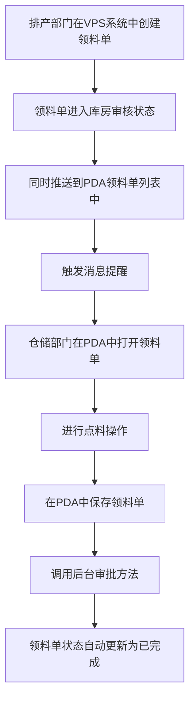

# 《生产领料单》移动端APP产品需求文档

## 一、文档概述

### 1.1 产品背景

生产领料单是配合《一物一码》需求上线的PDA单据，旨在将领料环节从传统纸质单据变更为扫码出库，实现领料流程的数字化管理。

### 1.2 产品核心目标

- 简化领料流程，提高工作效率
- 确保物料管理的准确性和可追溯性
- 实现领料过程的数字化管理
- 提供实时的物料库存和领料状态信息

### 1.3 适用范围

适用于生产部门从仓库领取物料的场景，主要用户为生产计划人员和仓库管理人员。

### 1.4 术语与缩写说明

- VSN：物料唯一标识码
- PDA：掌上电脑，用于仓库扫码操作
- META3：产品型号
- 领料条码：记录物料领料信息的条码，包含vender code（供应商代码）和入库月份

### 1.5 需求优先级定义说明

- 【P0-核心必做】：核心功能，必须实现，直接影响产品正常使用
- 【P1-重要迭代】：重要功能，影响用户体验但不影响核心流程
- 【P2-远期优化】：优化功能，可在后续版本中实现

### 1.6 业务流程图

### 1.7 消息提醒

#### 1.7.1 提醒场景

- 当排产部门在VPS系统中创建领料单并提交审核后，系统会自动推送消息提醒给仓储部门

#### 1.7.2 提醒内容

- 标题：新领料单待处理
- 内容：您有一张新的领料单需要处理，单号：\[领料单号]，请及时查看并处理
- 跳转：点击消息直接跳转到该领料单详情页面

#### 1.7.3 提醒方式

- PDA端消息通知
- 声音提醒
- 消息中心列表展示

### 1.8 输入控件规范说明

#### 1.8.1 选择框类型说明

| 控件类型 | 说明 | 使用场景 |
|----------|------|----------|
| 下拉选择框 | 点击后从下方弹出选项列表，仅支持单选（只能选择1个选项），下拉列表最多一次性显示5个选项，超出部分需点击"更多"查看 | 选项较少（≤10个）的场景，如制单人、领料部门等 |
| 点击选择框 | 点击后跳转新页面或弹出弹窗选择，支持单选/多选 | 选项较多（>10个）或需要搜索的场景 |

#### 1.8.2 文本内容换行规则

- 单行显示：选择框选中的内容在一行内显示，超出部分用"..."省略
- 下拉选项：下拉列表最多一次性显示5个选项，超出部分需点击"更多"查看，单个选项内容最多显示1行，超出部分用"..."省略
- 输入框：自动换行，最多显示3行，超出部分可滚动查看

#### 1.8.3 输入框类型说明

| 控件类型 | 说明 | 使用场景 |
|----------|------|----------|
| 文本输入框 | 单行文本输入，自动适配内容宽度 | 备注、名称等短文本输入 |
| 文本域 | 多行文本输入，支持换行 | 备注、说明等长文本输入 |
| 数字输入框 | 仅允许输入数字，自动弹出数字键盘 | 数量、金额等数值输入 |
| 日期选择器 | 点击弹出日期选择弹窗，支持选择日期 | 日期选择场景 |

## 二、全局通用规范【P0-核心必做】

### 2.1 全局页面结构规范

- 页面布局采用卡片式设计，清晰分隔不同功能区域
- 顶部导航栏固定，包含返回按钮和页面标题
- 内容区域可滚动，适应不同屏幕尺寸
- 底部操作按钮固定，便于用户操作

### 2.2 导航栏通用规则

- 左侧为返回按钮，点击返回上一页
- 中间为页面标题，显示当前页面名称
- 右侧为功能按钮（如保存、菜单等）

### 2.3 底部Tab栏通用规则

- 本产品为单流程应用，不使用底部Tab栏

### 2.4 通用弹窗与Toast规范

- 确认弹窗：用于删除、提交等重要操作，包含标题、内容、确认和取消按钮
- 提示Toast：用于操作成功、失败等轻量级提示，自动消失
- 输入弹窗：用于需要用户输入信息的场景

### 2.5 通用状态规范

- 加载状态：显示加载动画，提示用户系统正在处理
- 空状态：当列表无数据时显示空状态提示
- 成功状态：操作成功后显示成功提示
- 失败状态：操作失败后显示失败提示和原因

### 2.6 全局权限申请规则

- 扫码权限：使用摄像头扫描物料条码时需要申请相机权限
- 存储权限：保存草稿时可能需要存储权限

### 2.7 权限管理

- 权限来源：读取后台权限系统分配的权限
- 权限控制：不同角色根据后台分配的权限，只能访问和操作相应的功能
- 权限验证：每次操作前，系统会验证用户是否有相应的权限

### 2.7.1 角色权限定义

| 角色 | 功能权限 | 操作范围 |
|------|---------|----------|
| **仓储管理人员** | 查看领料单列表、打开待领料单据、扫码点料、编辑实领数量、保存/提交单据、打印标签、打印领料单 | 所有状态的领料单 |
| **产线人员** | 查看领料单详情、点击"领料退货"按钮、点击"领料置换"按钮 | 只读权限，仅可操作退货和置换功能 |
| **生产计划人员** | 创建领料单、编辑基本信息、添加物料、保存草稿、提交审核 | 仅创建和编辑功能 |

### 2.8 通用操作与交互规范

- 点击：用于按钮、列表项等可交互元素
- 长按：用于显示更多操作选项
- 滑动：用于列表滚动、筛选抽屉滑出等

### 2.9 系统适配

- PDA默认使用安卓系统
- 使用安卓原生控件样式，如导航栏、按钮等

## 三、核心功能模块需求详情

### 3.1 领料单列表【P0-核心必做】

#### 3.1.1 模块业务主流程

1. 用户打开领料单列表页面
2. 查看所有领料单信息
3. 使用搜索、筛选、排序功能找到目标领料单
4. 点击列表项查看领料单详情
5. 点击新增按钮创建新的领料单

#### 3.1.2 子页面需求详情

##### 3.1.2.1 领料单列表页面【P0-核心必做】

###### 3.1.2.1.1 页面概述

展示所有领料单的列表，包含单号、状态、领料人等信息，支持搜索、筛选和排序功能。

###### 3.1.2.1.2 页面前置条件

- 用户已登录系统
- 网络连接正常

###### 3.1.2.1.3 页面后置条件

- 点击列表项跳转到查看领料单页面
- 点击新增按钮跳转到新增领料单页面

###### 3.1.2.1.4 【原型描述】页面整体布局与全控件详情

- 顶部导航栏：
  - 左侧：返回按钮
  - 中间：页面标题"领料单列表"
  - 右侧：无
- 搜索区域：
  - 搜索框：文本输入框，占位符"输入单据编号/VSN进行检索"，单行显示，超出部分省略
  - 右侧：排序按钮和筛选按钮
- 统计信息区域：
  - 左侧：今日数量（取自列表合计今日领料数量）
  - 右侧：今日单据数量（取自列表合计，今天单据的数量）
- 列表区域：
  - 列表项：
    - 头部：
      - 左侧：领料单号
      - 右侧：状态标签（待领料/已完成）
    - 详情：
      - 作业类型（生产领料，写死）
      - 创建时间（系统自动生成，记录单据创建时间）
    - 操作按钮：
      - 打印按钮：取后台线上打印单据样式，右上角增加单码
      - 去点料按钮（仅待领料状态显示）

###### 3.1.2.1.5 核心交互流程说明

1. 搜索：在搜索框输入领料单号，系统实时显示匹配结果
2. 筛选：点击筛选按钮，从右侧滑出筛选抽屉，选择状态（待领料/已完成）进行筛选
3. 排序：点击排序按钮，弹出排序选项菜单，选择排序方式（创建时间正序、创建时间倒序）。默认按照创建时间倒序排序
4. 查看详情：点击列表项，跳转到编辑领料单页面
5. 去点料：点击去点料按钮，处理待领料状态的单子

###### 3.1.2.1.6 异常场景与处理逻辑

- 无网络连接：显示网络异常提示，点击重试按钮重新加载
- 无数据：显示空状态提示，提示用户暂无领料单

###### 3.1.2.1.7 功能验收标准

- 搜索功能：输入领料单号后，列表实时显示匹配结果
- 筛选功能：选择状态后，列表显示对应状态的领料单
- 排序功能：选择排序方式后，列表按照指定方式排序
- 跳转功能：点击列表项成功跳转到查看页面，点击新增按钮成功跳转到新增页面

### 3.2 领料单详情【P0-核心必做】

#### 3.2.1 模块业务主流程

1. 仓储部门打开待领料状态的单子，默认加载本单全部商品
2. 扫码将VSN和库存上屏
3. 编辑实领数量
4. 提交领料单
5. 当所有商品都完成领料后，单据状态变更为已完成

#### 3.2.2 子页面需求详情

##### 3.2.2.1 领料单详情页面【P0-核心必做】

###### 3.2.2.1.1 页面概述

用于创建和查看领料单，包含基本信息编辑、物料扫码点料、实领数量编辑等功能。

###### 3.2.2.1.2 页面前置条件

- 用户已登录系统
- 网络连接正常

###### 3.2.2.1.3 页面后置条件

- 保存草稿：领料单保存为草稿状态
- 确认领料并出库：领料单提交成功，跳转到查看页面

###### 3.2.2.1.4 【原型描述】页面整体布局与全控件详情

- 顶部导航栏：
  - 左侧：返回按钮
  - 中间：页面标题"新增领料单"或"领料单"
  - 右侧：保存为草稿按钮、设置按钮
- 信息编辑区域：
  - 源单据号：文本输入框，默认值取自后台单据，必填，单行显示，超出部分省略
  - 制单人：下拉选择框，默认值为当前用户，必填，选项超出一行时单行显示省略
  - 单据日期：日期选择器，默认值为当前日期，必填
  - 领料部门：下拉选择框，默认值为当前用户所在部门，必填，选项超出一行时单行显示省略
  - 生产领料单号：文本显示，系统自动生成，只读
  - 备注：文本域，非必填，最多显示3行，超出部分可滚动
  - 发料人：下拉选择框，默认为当前账号登录人，必填，选项超出一行时单行显示省略
  - 领料人：下拉选择框，默认为空，必填，选项超出一行时单行显示省略
- 扫描区域：
  - 扫描按钮：显示"扫描物料条码"，右侧显示"按实体键扫描"
  - 搜索框：文本输入框，占位符"搜索物料编码/VSN码"，单行显示
- 物料列表区域：
  - 物料组：
    - 物料组头部：
      - 左侧：序号
      - 右侧：物料编码（取该商品档案编码）、物料名称（取该商品档案名称）、单位
    - 物料内容：
      - 左侧：物料图片
      - 右侧：
        - 物料统计信息：领料总数量、可用数量
        - VSN表格：
          - 表头：VSN、库位、实领、操作
          - 表体：
            - VSN：文本显示，扫描时填入
            - 库位：下拉选择框，默认取有库存的第一条数据，可选项为所有有库存的地点，选项超出一行时单行显示省略
            - 实领：数字输入框，可编辑
            - 操作：
              - 唯一码商品：打印按钮（在表格中）
              - 商品码商品：打印按钮（在商品上）
            - 删除按钮
- 统计区域：
  - 总领料数量：显示总领料数量
  - 已领取：显示已领取数量和总领料数量
  - 完成率：显示完成百分比
- 底部操作区域（新增页面）：
  - 左侧：实领数量显示，格式"实领：XX"
  - 中间：打印按钮
  - 右侧：提交领料按钮
- 底部操作区域（已完成页面）：
  - 领料退货按钮：仅有权限的产线人员可见，点击后推送并打开生产退料单
  - 领料置换按钮：仅有权限的产线人员可见，点击后推送并打开生产置换单
  - 打印领料单按钮

**编辑状态说明：**
- 对于已经领料完成且确认过的商品，置灰不可再次修改
- 对于部分领料的商品，可继续修改实领数量，但数量不可减少，只能增加或保持不变
- 对于未领料的商品，可自由修改实领数量

###### 3.2.2.1.5 核心交互流程说明

1. 编辑基本信息：修改领料部门和单据日期
2. 扫描物料：点击扫描按钮，启动摄像头扫描物料条码
3. 搜索物料：在搜索框输入物料编码或VSN码，显示匹配结果
4. 删除物料：点击删除按钮，确认后删除物料
5. 编辑实领数量：修改实领数量输入框，系统实时更新统计信息
6. 打印标签：点击打印按钮，打印物料标签
7. 保存草稿：点击保存按钮，保存当前编辑内容
8. 打印领料单：点击打印按钮，打印整个领料单
9. 确认领料并出库：点击确认领料并出库按钮，系统验证信息并提交
   - 检查是否所有物料都已领料
   - 如果存在未领料的物料，显示确认弹窗："存在部分商品未领料，是否继续出库已经领用的商品？"
   - 用户选择"是"：提交成功，跳转到查看页面
   - 用户选择"否"：取消提交操作
   - 所有物料都已领料：直接提交成功，跳转到查看页面

###### 3.2.2.1.6 异常场景与处理逻辑

- 扫描失败：显示扫描失败提示，提示用户重新扫描
- 搜索无结果：显示无结果提示，提示用户检查输入
- 提交时无物料：显示提示，要求用户至少添加一个物料
- 保存为草稿后不可删除：领料单保存为草稿状态（PDA草稿）后，在PDA上不可删除该单据，只能继续编辑或提交

###### 3.2.2.1.7 功能验收标准

- 基本信息编辑：成功修改领料部门和单据日期
- 物料添加：成功通过扫描或搜索添加物料
- 实领数量编辑：修改实领数量后，统计信息实时更新
- 保存功能：成功保存草稿，状态变为"待领料（PDA草稿）"
- 删除功能：PDA草稿状态的单据不可删除
- 提交功能：成功提交领料单并跳转到查看页面

## 四、非功能需求规范

### 4.1 性能需求

- 页面加载时间：冷启动≤2s，热启动≤1s
- 操作响应时间：点击操作≤500ms，扫描操作≤2s
- 网络超时：弱网环境下请求超时时间≤10s，超时后显示网络异常状态

### 4.2 兼容性需求

- 支持Android 6.0及以上版本
- 适配不同屏幕尺寸，优先考虑移动设备使用场景

### 4.3 安全需求

- 数据传输加密：所有网络请求使用HTTPS
- 用户认证：使用token进行身份验证
- 权限控制：不同角色有不同的操作权限

### 4.4 其他非功能需求

- 可维护性：代码结构清晰，易于维护
- 可扩展性：支持后续功能扩展
- 可测试性：代码可单元测试，功能可集成测试

## 五、附录

### 5.1 需求疑问点

- 物料扫描功能的具体实现方式（使用系统相机还是第三方扫码库）
- 打印标签的具体格式和内容
- 物料库存的实时更新机制

### 5.2 其他补充说明

- 本需求文档基于现有HTML原型和业务流程编写
- 后续可根据实际使用情况进行功能优化和扩展
- 建议在正式上线前进行用户测试，收集反馈后再进行调整

### 5.3 角色用例说明

#### 5.3.1 仓储管理人员用例
- **前置条件**：用户为仓储管理人员角色，已登录系统
- **主要操作**：
  1. 接收并查看新领料单通知
  2. 打开待领料状态的单据
  3. 扫码将VSN和库存上屏
  4. 编辑实领数量
  5. 查看已完成领料的商品（颜色区分）
  6. 提交领料单
  7. 打印物料标签和领料单
- **后置条件**：领料单状态更新，库存信息同步

#### 5.3.2 产线人员用例
- **前置条件**：用户为产线人员角色，已登录系统
- **主要操作**：
  1. 查看领料单详情
  2. 确认物料信息
  3. 点击"领料退货"按钮（有权限时）
  4. 点击"领料置换"按钮（有权限时）
- **限制**：
  - 所有字段为只读状态
  - 仅可操作"领料退货"和"领料置换"功能
  - 无权限编辑或修改任何领料信息